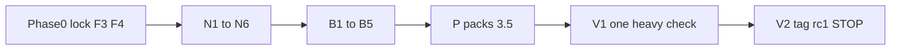

# Full-build v3: light merges + one final check + packs 3.5 first

## Policy (operator 2026-09-16)

- No long-lived locks. Each phase = short feature branch → **cheap gates** → ff-merge + push main immediately.
- **Per-phase cheap gates only:** touched-module unit tests · `npx tsc --noEmit` **only if UI touched** · hardcode-scan touched = 0. Do not merge if touched units red.
- **Heavy suites once in V1:** full unittest discover · `ci_full.ps1` without `-SkipSmoke` · `test:field` idle ×3 · `dual_network_smoke.py` · `verify_da3_weights.py` · `smoke_portable` · `smoke_lbs_ft`.
- Air-gap: network features opt-in (never on boot); WS under JWT; REST worker remains offline-compose fallback (parity for each WS feature).
- Python `muravei_env` only; PROTECT absolute; purge only `stage_*` / `*.locked_*`.
- No binaries/ZIP in git or GitHub; release = changelog only.
- Phase red after **2** fix cycles → STOP + report.
- Release train: **`v3.5.0-rc1` → GA `v3.5.0`** (includes 3.3+3.4+3.5 scope).

## Baseline

- `main` tip: **`ec80cd5`**; `git log main..feature/network-chat-v3.3` empty
- Chat today: REST worker ~15 s ([`backend/api/network.py`](backend/api/network.py) + [`network_sync.py`](backend/services/network_sync.py))
- WS pattern: [`/ws/detect/{viewer_id}?token=`](backend/api/detect.py) + [`ws_user`](backend/services/security.py) ~118
- Pack bands: Mini 4.5/5 · FullKit no-DA3 9.5/10 · FullKit+DA3 18/22



---

## Phase 0 — Lock retire + cheap hygiene (F3+F4)

- Delete `feature/network-chat-v3.3` local+remote (no unique commits).
- Docs: ROADMAP / KNOWN_ISSUES / SKILL_CODEX / SKILL_QWEN_LOCAL — «lock retired by operator decision 2026-09-16; scope lands in main via N1–N6».
- F3: [`.gitignore`](.gitignore) `+= sidecars/colmap/downloads/`
- F4: [`VERSION`](VERSION) = `git describe --tags --always`
- Commits: `docs: retire v3.3 lock` · `chore: gitignore colmap downloads` · `fix(version): describe` → light gates → ff-merge

---

## Epoch v3.3 — Network realtime (N1–N6; light gates on merge)

### N1 — WS realtime chat

- `/ws/chat?token=` (JWT, detect pattern); hub connection registry; **single-worker uvicorn** noted in KNOWN_ISSUES / ENGINEER_GUIDE
- After SQLite insert **and** inbound worker ingest → hub emits `{type:"chat.message", message}`
- FE [`useNetworkStore`](src/store/useNetworkStore.ts): WS when `mode!=='off'`; merge+unread without waiting for poll; poll stays backup
- Unit: handshake/auth/reject/relay (dual-instance latency E2E deferred to **V1**)
- Commit: `feat(network): WS realtime chat`

### N2 — Attachments (S2)

- Crop/screenshot **bytes** cap 8 MB via **chunked REST** (POST chunks + sha256 verify on receiver)
- WS carries only `chat.message` with `attachment_id` (offline-compose parity with REST worker)
- Store `archive/network_attachments/` (gitignore); ChatPanel button; remote preview from bytes
- Unit: reassembly + sha-mismatch reject
- Commit: `feat(network): chat attachments bytes`

### N3 — Detection refs

- Token `detection:<id>` clickable; local seek+highlight; remote card (base/GPS/notes)
- Commit: `feat(network): detection refs in chat`

### N4 — Recon package share (S3)

- Opt-in per-job chunks sparse/dense/mesh/splat + manifest + sha256
- Receiver: **disk-space preflight** + **per-artifact checkboxes** + **resume by chunk index** after reconnect; UI progress + RU «недостаточно места»; unpack to `archive/recon/<job>/`
- Commit: `feat(network): recon package share`

### N5 — LAN beacon (S4)

- Opt-in, never on boot; UDP broadcast **only** `base_id` / `base_name` / `port` (**no PIN/secrets**); beacon does not authorize — JWT on subsequent REST/WS; settings toggle
- Commit: `feat(network): opt-in LAN beacon`

### N6 — Smoke extension + light docs

- Extend [`dual_network_smoke.py`](backend/scripts/dual_network_smoke.py) for realtime/attach/refs/package/beacon — **execute only in V1**
- Minimal per-phase docs lines; full what-syncs table in V1 gap-table
- Commit: `docs: v3.3 network realtime sync`

---

## Epoch v3.5 — Backlog (B1–B5; light gates on merge)

| Phase | Work | Commit |
|-------|------|--------|
| B1 | Perf table ms/VRAM @ 8 GB → CONFIGURATION + KNOWN_ISSUES | `docs(perf): budget table` |
| B2 | `GET /api/export/masks-geotiff\|kml`; GPS required for geotiff | `feat(export): mask GeoTIFF/KML` |
| B3 | Full-video SAM propagate chunks ≤30 + overlap, VRAM guard, abort, opt-in persist | `feat(seg): full-video propagate chunked` |
| B4 | Seed `torch*+cu128*` in portable/cache/wheels; rebuild in P; or documented skip | seed / `docs: CUDA skip` |
| B5 | tactical s/m/l-ft + AP eval; do not touch `yolo26n-ft.pt`; or skip reason | `feat(train): …` / docs skip |

---

## Phase P — Packs 3.5 immediately (cache-first; no heavy smoke here)

- Mini + FullKit win_cpu+DA3 + (win_cuda+DA3 if B4 green)
- Inventory cache vs manifest; fetch **only** missing (sha-verify); zero re-downloads
- Build asserts bands + Mini da3 bins=0 + torch profile + stage 4×safetensors+NOTICE
- Record size+sha256 of all ZIPs for report → later Meta/RELEASE_NOTES
- Do **not** commit ZIPs. Commit: `docs: pack shas v3.5 pre-final-check`

---

## Phase V1 — Single final heavy check (explicit order A2)

**(a)** F1 prep commit: `VITE_MURAVEI_E2E=1` skip AdminPanel HW-poll + `window.__MURAVEI_E2E__` + Playwright assert + KNOWN_ISSUES residual + TESTING (vite-dev only)

**(b)** F2 prep commit: `ci_full` Meta assert tip-or-tip~1-docs-only + DOCS_SYNC_CHECKLIST

**(c)** One heavy suite run:

```
unittest discover FULL
npx tsc --noEmit
ci_full.ps1   # no -SkipSmoke: smoke Mini+Full, DA3 A/B, Meta assert
npm run test:field   # idle ×3 → expect 6/6
dual_network_smoke.py  # all N1–N5 cases
verify_da3_weights base/large/metric  # depth median/std
smoke_lbs_ft
hardcode-scan all touched = 0
```

**(d) A1 flake-triage:** if field×3 ≠ 6/6, insert `test(flake): stabilize <root-cause>` **before** docs final sync. Triage root-cause-first: media readyState / detect-config timing / AdminPanel layout → test-side fix; product bug → separate `fix(ui|live|...)` with root-cause in body. Residual only with **explicit operator acceptance line** in V1 report.

**(e)** `docs: v3.5 final sync + RELEASE_NOTES_v3.5.0-rc1.md` (RU: what's new 3.3+3.4+3.5; evidence pack shas / unit count / depth / field×3 / dual-smoke; limits giant≥16 GB grey, flake residual, NC → ATTRIBUTION+README; packs = offline channel)

Red on (c)/(d) → ≤2 fix cycles per item → re-run. Not green → **do not tag**.

---

## Phase V2 — Tag + STOP (A2.f)

1. `docs: Meta tip-equal`
2. `git tag -a v3.5.0-rc1` (body: tip, pack shas, bands, unit count, NC)
3. Push main + tag
4. Draft gh release notes-only (soft-skip if unauthed)
5. Full cumulative report → **STOP** for operator field armor of packs 3.5 → then GA `v3.5.0`

---

## Order and reporting

`Phase0 → N1…N6 → B1…B5 → P → V1 → V2`

After each phase: short checkpoint (`hash | touched unit count | hardcode=0 | docs | deviations`) then auto-continue. Full report only at V2 (+ interim after V1 run).

Relay to operator: N1/N4/N6 unit counts; B4/B5 seed-or-skip; P ZIP sizes+shas; V1 heavy tails; V2 tag + notes → field armor → GA.

## STOP before APPROVE

Do not execute until operator replies **APPROVE**. First action after APPROVE: **Phase 0**.
