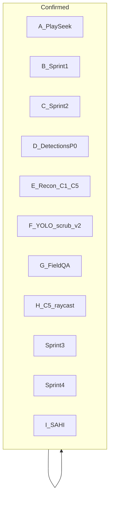

# Мастерплан: полевая готовность MuraveiVision PRO

**Правило отображения (Plan mode):** всегда выводить **этот полный мастерплан**.  
- Подтверждённые фиксы — зелёная галочка.  
- Если регрессия/недоделка — **галочку снять**, статус → NOW/reopen, пройти зависимости по проекту.  
- Не ставить галку только потому что «код написан» — нужна проверка критерия / скринкаст.

**Легенда:** подтверждено | в работе / не подтверждено | позже

---

## Жёсткие правила

- Python: только `.\muravei_env\Scripts\python.exe` (3.12.10).
- Не ломать без явной задачи: remount-safe, `syncMode`, overlay-after-seeked, scrub API, YOLO reconnect, scoped hydrate.
- После пакета: `npm run build`.
- При изменении «готового» пункта: снять галку → найти dependents → править все затронутые файлы (см. матрицу внизу).

---

## A. Play / Seek / Remount / Compare Sync

| Пункт | Статус |
|-------|--------|
| Seek только на scrub / seekEpoch (не на каждый playhead) | ✅ |
| `pendingSeek` + settle только на `seeked` | ✅ |
| Overlay = `video.currentTime` (не playhead при seek) | ✅ |
| WS: не слать/не применять YOLO пока seeking/pendingSeek | ✅ |
| `viewerTimeCache` + remount publish guard | ✅ |
| `syncMode` follow; slave не публикует playhead | ✅ |

Файлы: [`Viewer.tsx`](src/components/panels/Viewer.tsx), [`timeline-store.ts`](src/store/timeline-store.ts).

**Зависимости:** F (scrub gate) опирается на scrub API и settleSeek — при правке F не откатывать A.

---

## B. Sprint 1 — UI stability

| ID | Пункт | Статус |
|----|-------|--------|
| P0.1 | Mosaic `removeLeaf` legacy-safe + `convertLegacyToNary` + binary presets | ✅ |
| P0.2 | Maximize restore-then-maximize | ✅ |
| P0.3 | Viewer scrub через `start/update/endScrubbing` | ✅ |
| P0.4 | Inspector notes debounce + `notesTargetIdRef` | ✅ |
| P1.7 | Compare slave drift correction 500ms | ✅ |
| P1.8 | YOLO WS reconnect backoff, max 10 | ✅ |
| P1.13 | `pendingJump` + try/finally + timeout 5s | ✅ |
| P1.15 | Timeline zoom hysteresis + filmstrip clamp | ✅ |

Файлы: `layoutActions.ts`, `usePanelLayoutStore.ts`, `initialLayout.ts`, `Inspector.tsx`, `Viewer.tsx`, `timeline-store.ts`, `Timeline.tsx`.

---

## C. Sprint 2 — Backend reliability

| ID | Пункт | Статус |
|----|-------|--------|
| P0.5 | Recorder ffmpeg stdout/stderr → DEVNULL | ✅ |
| P0.6 | `normalize_media_path` на INSERT/WHERE | ✅ |
| P1.9 | Live `active` + `thread.is_alive()` | ✅ |
| P1.10 | `asyncio.to_thread` (ai / reports / support) | ✅ |
| P1.11 | Trainer `.pt.backup` + `empty_cache` + один callback | ✅ |
| P1.12 | Crop bbox clamp / reject | ✅ |
| P1.14 | Scan SSE не рвёт на idle; фронт done/error | ✅ |

Файлы: `recorder.py`, `db.py`, `detections.py`, `live_stream.py`, `ai.py`, `reports.py`, `support.py`, `trainer.py`, `scan.py`, `useBatchScanStore.ts`, `useAutoBatchScan.ts`.

---

## D. Детекции — фильтр по видео (P0)

**Подтверждено скринкастом** (Network `source_video=`, Inspector N/N текущего ролика).

| Пункт | Статус |
|-------|--------|
| HTTP GET без `source_video` → `[]` (db unscoped для trainer/reporter/similarity) | ✅ |
| Scoped hydrate + module AbortController + debug logs | ✅ |
| Inspector / Gallery / Viewer / TopBar по `sourcePath` | ✅ |
| File-exists gate + bulk soft-delete «Очистить» | ✅ |
| MediaPool trash → `clearDetections` | ✅ |
| Timeline markers `React.memo` | ✅ |
| ~~P1 YOLO scrub gate (только isScrubbing)~~ | **СНЯТО** — тест провален, см. F |

Критерий P0: Медиа ↔ Монтаж = N текущего ролика.

---

## E. Photogrammetry Sprint C

| ID | Пункт | Статус |
|----|-------|--------|
| Pre | ffprobe duration, ignoreSeek reset, ai_class backfill | ✅ |
| C.1 | COLMAP poses + intrinsics | ✅ |
| C.2 | gsplat train hook | ✅ |
| C.3 | Flight3D dual load Points / DropInViewer | ✅ |
| C.3b | Manual scale / horizon | ✅ |
| C.4 | docs + staging script | ✅ |
| C.5 | 2D→3D raycast (не THREE.Raycaster) | ✅ |

---

## F. YOLO scrub gate v2 — DONE ✅

**Статус: код влит, критерии подтверждены** (Playwright `yolo-scrub-gate.test.ts` PASS, debug API `window.muraveiDebug`/`getYOLOStats`/`printYOLOReport`, визуальный overlay в dev-режиме). Слабый `isScrubbing`-gate снят.

**Реализовано в коде** (`Viewer.tsx`, `Timeline.tsx`): yoloSuspendRef+400ms; filmstrip 5px; WS before parse; paused 500ms; seek debounce 100ms; Live без gate; `console.debug('[YOLO] skip:')`. `npm run build` OK.

### Корни

1. Aggressive paused RAF (`Δt > 40ms`).
2. Filmstrip → `seekTo` без scrub.
3. Race: `endScrubbing` снимает флаг → YOLO сразу.

### Implementation Notes

1. **`yoloSuspendRef`:** clear только `setTimeout(400)`; отменять таймер при новом scrub. Порядок в `sendFrame`: suspend → cooldown → store flags → paused 500ms. Live не трогать.
2. **Filmstrip:** click vs drag (5px); всегда `endScrubbing()`.
3. **WS:** ignore **до** `JSON.parse`.
4. **Seek debounce 100ms** на дискретные клики.

### Критерии F (галочку ставить только после скринкаста)

- [x] Scrub: 0 WS JPEG, 0 `[YOLO] infer`
- [x] Suspend clear только через 400ms timeout
- [x] Filmstrip drag/click
- [x] WS ignore до parse
- [x] Paused ≤ 1/500ms
- [x] Seek debounce ~100ms
- [x] Console `[YOLO] skip:` при scrub
- [x] Live OK
- [x] `npm run build`

### Зависимости при правке F (проверить всё)

| Область | Файлы / действия |
|---------|------------------|
| Viewer YOLO RAF + WS | `Viewer.tsx` — sendFrame, onmessage, settleSeek, scrub bar |
| Timeline scrub + filmstrip | `Timeline.tsx` — нижний трек + filmstrip pointers |
| Store scrub flags | `timeline-store.ts` — не ломать start/update/end; не снимать isScrubbing раньше timeout на клиенте |
| Markers click | `Timeline.tsx` / `TimelinePanel.tsx` — debounce seek, не отключать jump |
| Compare Sync | slave drift interval — не слать YOLO с slave при suspend |
| Live path | `isLive` ветка без suspend-gate |
| Auto batch scan | не путать серверный batch YOLO с Viewer WS |
| Hydrate/detections | D остаётся; не откатывать scoped hydrate |

---

## G. Field regression QA — DONE ✅

`npm run test:field` — 3/3 Playwright passed (`yolo-scrub-gate`, `field-regression`, `recon-raycast`). REC 61с — PASS (62.8 MB). Backend unit tests 3/3.

- [x] Вкладки: scoped N
- [x] Soft-delete переживает вкладки
- [x] Play / scrub / jump / Compare Sync
- [x] REC >60s; Live active=false
- [x] Scrub без YOLO (F)
- [x] Network: `source_video=`

---

## H. Photogrammetry C.5 — DONE ✅

`recon-raycast.test.ts` PASS; COLMAP intrinsics (PINHOLE/SIMPLE_PINHOLE/SIMPLE_RADIAL/RADIAL/OPENCV) исправлены; `SplatHit` тип выровнен с `gaussian-splats-3d`.

- [x] Raycast intrinsics + splat pick
- [x] Miss → toast

---

## LATER — Sprint 3 / 4 — DONE ✅

| Sprint | Темы | Статус |
|--------|------|--------|
| 3 | Rules/alerts; AL loop; playbackRate; draw class picker | ✅ |
| 4 | Ollama autolabel UI; per-class conf; docs cleanup | ✅ |

---

## I. SAHI — Slicing Aided Hyper Inference — DONE ✅

Опциональный путь инференса для мелких объектов на 4K-кадрах БПЛА. Модель переиспользуется (без дубля VRAM); выходной контракт идентичен + `"sahi": true`; фронтенд не модифицирован.

| Пункт | Статус |
|-------|--------|
| `backend/services/sahi_yolo_engine.py` — slice + remap + merge, graceful fallback | ✅ |
| `yolo_engine.py` — additive `infer_sahi`/`_predict_sync_sahi`/`_finalize_sync`, ядро не тронуто | ✅ |
| `detect.py` — `use_sahi`/`slice_*`/`overlap_ratio` в REST + WS, маршрутизация | ✅ |
| `system.py` — `GET/PUT /api/system/detect-config` (SQLite settings) | ✅ |
| `requirements.txt` — `sahi>=0.11.0` | ✅ |
| `test_sahi_inference.py` — PASS (`sahi_flag=True`, `nms=sahi`) | ✅ |
| `docs/API.md` — `use_sahi` + `detect-config` | ✅ |

**Проверки:** `compileall backend` PASS · `npm run build` PASS · `smoke_lbs_ft.py` PASS (быстрый путь цел) · numpy 1.26.4 / opencv-python-headless 4.11.0 / sahi 0.12.6 / Python 3.12.10. `pip check`: benign-предупреждение (sahi декларирует `opencv-python>=4.12` non-headless имя; `cv2` предоставляется headless-сборкой, runtime OK).

**Переключатель:** по умолчанию выключено; `PUT /api/system/detect-config {use_sahi_default:true}` (engineer) или разовый `POST /api/detect {use_sahi:true}`.

---

## Порядок

1. **F** ✅ → 2. **G** ✅ → 3. **H** ✅ → 4. Sprint 3/4 ✅ → 5. **I. SAHI** ✅

## Карта планов

| План | Статус в мастерплане |
|------|----------------------|
| video_play_seek_fix | A ✅ |
| sprint1_ui_stability | B ✅ |
| Sprint 2 backend | C ✅ |
| detections_video_filter | D ✅ ; P1 scrub **снят** → F |
| fix_yolo_scrub_gate | F ✅ |
| photogrammetry_colmap_gsplat | E / H ✅ |
| audit_fixes_roadmap | S3 ✅ / S4 ✅ |
| sahi_integration | I ✅ |

---

## Следующее действие

Все пункты мастерплана (A–I) завершены и подтверждены тестами. Текущих открытых задач нет. Возможные следующие шаги (по запросу):
- Полевой скринкаст SAHI на реальном 4K-кадре БПЛА для сравнения counts fast vs sliced.
- Вынести `use_sahi_default` в UI инженера (опционально, по запросу).
