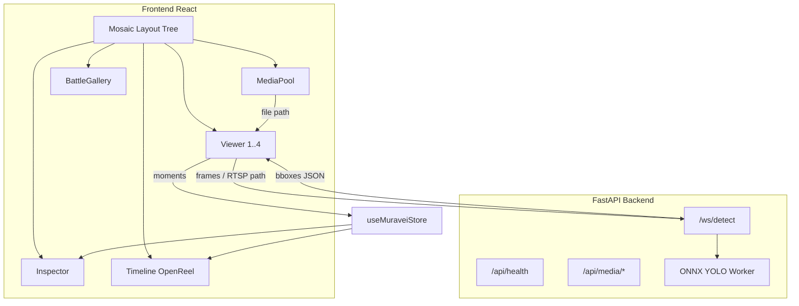
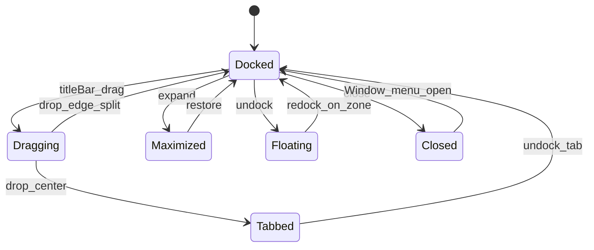
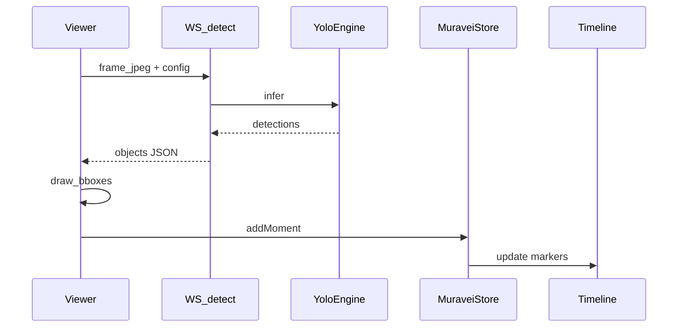

# MuraveiVision PRO: Mosaic Layout + YOLO + DaVinci UI

> **СТАТУС ПЛАНА: ПОЛНОСТЬЮ ВЫПОЛНЕН ✅** (все Фазы 0–10, Спринты A–E).
> Подтверждения: `npm run build` PASS · `npm run test:field` 3/3 PASS · backend unit tests 3/3 PASS · smoke-тесты зелёные.
> Актуальные статусы по всем подсистемам — в [masterplan_field_readiness_ef8c3728.plan.md](.cursor/plans/masterplan_field_readiness_ef8c3728.plan.md) (разделы A–I, включая SAHI).

## Контекст

Документ [рефакторин_главный.pdf](c:\Users\MECHREVO\Desktop\рефакторин_главный.pdf) (v7.1) требует **layout-дерево**, **drop-зоны** и **flex с min-size** — уровень Premiere/DaVinci, а не текущий фиксированный `PanelGroup` в `[src/App.tsx](src/App.tsx)`.

Сейчас:

- UI-каркас на `react-resizable-panels` (без дерева/DnD панелей)
- Viewer/Inspector — заглушки; Timeline/MediaBrowser — моки
- Backend только `[GET /api/health](backend/main.py)`
- OpenReel лежит в `[openreel-reference/](openreel-reference/)` (playback, timeline, video-engine)
- Типы/store под YOLO уже есть: `[src/types/muravei.ts](src/types/muravei.ts)`, `[src/store/useMuraveiStore.ts](src/store/useMuraveiStore.ts)`

**Выбранный подход (из PDF):** `react-mosaic-component` + `react-dnd` — не кастомное дерево.

**Визуал:** тема DaVinci Resolve (тёмный UI, серые панели `#252525`/`#1a1a1a`, оранжево-красные акценты playhead/selection, плоские заголовки панелей без «карточек»).

**Поведение панелей:** как в Adobe Premiere Pro — перетаскивание за title bar, прилипание к зонам, разворот, сворачивание, вкладки, float/redock (см. Фазу 3).

---

## Целевая архитектура




---

## Фаза 0 — Подготовка ✅

1. Доработать `[backend/main.py](backend/main.py)`: уже есть `BASE_DIR` / `safe_path_resolve` / ffmpeg PATH — проверить и добить lifespan (логи, каталоги `cache/`, `logs/`).
2. Добавить `backend/desktop_launcher.py` (pywebview → `http://127.0.0.1:3000` в dev / static в prod) — по PDF.
3. Зависимости frontend:
  - `react-mosaic-component`, `react-dnd`, `react-dnd-html5-backend`
  - убрать опору UI на `react-resizable-panels` в `App` (можно оставить в package до миграции).
4. Тема DaVinci: CSS-переменные в `[src/index.css](src/index.css)` (`--dv-bg`, `--dv-panel`, `--dv-border`, `--dv-accent`, `--dv-playhead`) + стили mosaic window chrome.

---

## Фаза 1 — Дерево макета (Mosaic) ✅

Файлы:

- `[src/layout/initialLayout.ts](src/layout/initialLayout.ts)` — дерево из PDF (MediaPool | Viewers / Inspector+Timeline)
- `[src/layout/layoutStorage.ts](src/layout/layoutStorage.ts)` — save/load `muraveivision-layout`
- `[src/components/ComponentRegistry.tsx](src/components/ComponentRegistry.tsx)`
- Переписать `[src/App.tsx](src/App.tsx)`: `TopBar` + `Mosaic` на весь viewport (`h-screen overflow-hidden`)

Default tree (как в PDF):

```
row: media-pool | column(
  row: viewer-1 | viewer-2,
  row: inspector | timeline
)
```

`BattleGallery` — отдельный leaf, подключается в preset или через drop.

---

## Фаза 2 — Leaf-компоненты (каркас UI) ✅


| ID            | Компонент           | Назначение                                |
| ------------- | ------------------- | ----------------------------------------- |
| `media-pool`  | `MediaPool.tsx`     | дерево файлов (сейчас мок в MediaBrowser) |
| `viewer-1..4` | `Viewer.tsx`        | видео + canvas bbox + YOLO toggle         |
| `inspector`   | `Inspector.tsx`     | список детекций, Ollama/notes             |
| `timeline`    | `Timeline.tsx`      | OpenReel-based + detection markers        |
| `gallery`     | `BattleGallery.tsx` | кропы/моменты                             |


Каждая панель: заголовок в стиле DaVinci (иконка + title + toolbar), `minSize` (Viewer ≥ 400×300).

Существующие `[MediaBrowser.tsx](src/components/MediaBrowser.tsx)` / `[Timeline.tsx](src/components/Timeline.tsx)` — переиспользовать логику, обернуть в mosaic windows.

---

## Фаза 3 — Premiere-like docking (ключевое требование) ✅

Цель: оператор работает с панелями **как в Adobe Premiere** — перетащил, прилипло, развернул, вернул.

### Поведение (чеклист UX)


| Действие                 | Поведение                                                                               |
| ------------------------ | --------------------------------------------------------------------------------------- |
| Drag за title bar        | Панель «отлипает», курсор показывает ghost                                              |
| Hover над другой панелью | 5 drop-зон: TOP / BOTTOM / LEFT / RIGHT / CENTER                                        |
| Drop на край (20%)       | Split текущего leaf — панель **прилипает** сбоку/сверху/снизу                           |
| Drop в CENTER            | Tab group: панели в одной ячейке со вкладками (как Premiere)                            |
| Resize splitter          | Соседние панели масштабируются пропорционально (flex), с `minSize`                      |
| Maximize / Expand        | Одна панель на весь workspace; повторный клик — restore предыдущего дерева              |
| Collapse / Minimize      | Схлопывание в узкую полоску или в tab bar; reopen из Window menu                        |
| Close panel              | Удаление leaf из дерева; панель доступна через меню «Window → …»                        |
| Undock → Float           | Окно поверх workspace (absolute/portal); drag обратно на drop-зону = **redock**         |
| Snap при float           | Float-окно прилипает к краям viewport и к границам других float (опционально Sprint B+) |


### Техническая реализация на `react-mosaic-component`

Mosaic уже даёт binary tree + edge/center drop + resize. Дополнительно поверх:

1. `**PanelChrome**` (`src/layout/PanelChrome.tsx`) — title bar как в Premiere/DaVinci:
  - drag handle, title, tab strip (если tabs)
  - кнопки: maximize, float, close
2. `**DropZoneOverlay**` — явные визуальные индикаторы 5 зон (полупрозрачные прямоугольники accent-цвета) при drag; стилизовать под Premiere (синий/оранжевый highlight), не дефолтный mosaic.
3. `**layoutActions.ts**` — операции над `MosaicNode`:
  - `maximizePanel(id)` / `restoreLayout()` — хранить `preMaximizeTree` в store
  - `closePanel(id)` / `openPanel(id, dockTarget?)`
  - `setTabGroup(parentPath, ids[])` — center-drop → tabs
4. `**FloatingPanelHost**` (`src/layout/FloatingPanelHost.tsx`):
  - список undocked панелей: `{ id, x, y, w, h }`
  - DnD из float обратно в Mosaic `onDrop` → remove from float list + insert into tree
5. `**usePanelLayoutStore**` (Zustand):
  - `mosaicTree`, `floatingPanels`, `preMaximizeTree`, `closedPanels`
  - sync с `layoutStorage` (persist всё, включая float positions)




### Визуальные правила drop-зон (из PDF)

```
┌─────────────────────────────┐
│           TOP 20%           │  → split above
├────────┬──────────┬─────────┤
│ LEFT   │  CENTER  │  RIGHT  │  → split / tabs / split
│  20%   │   40%    │   20%   │
├────────┴──────────┴─────────┤
│         BOTTOM 20%          │  → split below
└─────────────────────────────┘
```

### Фаза 4 — Flex + persistence + Window menu ✅

- `minSize` на каждый leaf (Viewer ≥ 400×300; Timeline height ≥ 120px).
- Persist: mosaic tree + floating + closed + maximize snapshot → `localStorage` key `muraveivision-layout`.
- Reset layout в TopBar.
- Меню **Window**: список панелей (Media Pool, Viewer, Inspector, Timeline, Gallery) — show/hide / bring to front.

### Фаза 5 — Multi-viewer ✅

- Presets layout: 1 / 2 / 4 Viewer через смену mosaic tree (не ломая docking).
- Каждый Viewer: свой `viewerId`, источник (файл / RTSP), флаг `yoloEnabled`.
- Состояние в `viewer-store` (`sources: Record<viewerId, ViewerState>`).
- Preset switch сохраняет возможность ручного docking после применения.

---

## Фаза 6 — OpenReel core (playback/timeline) ✅

По `[setup-structure.ps1](setup-structure.ps1)` и точечному переносу (не весь monorepo):

Из `openreel-reference/packages/core/src/`:

- `playback/master-timeline-clock.ts`, `playback/playback-controller.ts`
- `timeline/clip-manager.ts`, `track-manager.ts` (по необходимости)
- `video/playback-engine.ts` — только если нужен decode в браузере; для MVP YOLO достаточно `<video>` + frame grab

Уже есть адаптированные типы `[src/core/types/muravei.ts](src/core/types/muravei.ts)` и store `[src/store/timeline-store.ts](src/store/timeline-store.ts)` — связать Timeline UI с `playheadPosition` / `seekTo`, убрать моки из `App.tsx`.

**Принцип:** OpenReel = clock + timeline editing; YOLO = overlay + markers, не замена NLE-движка.

---

## Фаза 7 — YOLO detection pipeline (ядро продукта) ✅

### Backend

- `backend/services/yolo_engine.py` — загрузка ONNX (`yolo26s-worldv2-finetuned.onnx` из конфига store), `onnxruntime-gpu` с fallback CPU.
- `backend/api/detect.py` + WebSocket `/ws/detect/{viewer_id}`:
  - клиент шлёт JPEG/frame + `confidence` / `frameStep`
  - сервер отвечает `{ objects: DetectedObject[], frameIdx, timeSec }`
- `backend/api/media.py` — `/api/media/tree`, delete (разблокировать MediaPool).
- Модель/классы: маппинг на `[MilitaryClass](src/types/muravei.ts)`; конфиг из `AnalysisConfig`.

### Frontend Viewer

- `<video>` или canvas preview
- loop: `requestAnimationFrame` / каждый N-й кадр → WS
- отрисовка bbox на overlay-canvas (цвета классов как в Timeline)
- REC stub → запись в `archive/` через API позже

### Связка

- `addMoment` / `setMoments` в store → маркеры на Timeline + список в Inspector




---

## Фаза 8–10 — Остальное из v7.0 (после YOLO MVP) ✅

- **Inspector:** детали bbox, notes, флаг, вызов Ollama (если `aiAnalystEnabled`)
- **BattleGallery:** сетка кропов по `moments`
- **Вкладки TopBar:** MEDIA / EDIT / AI ANALYSIS / TRAINING / SYSTEM — смена mosaic presets + контента
- **Auth:** JWT/bcrypt из requirements — роли operator/engineer/master (после стабильного детекта)

---

## Порядок реализации (спринты)

1. **Sprint A:** Фазы 0–2 — mosaic shell + DaVinci chrome + пустые leafs ✅
2. **Sprint B:** Фаза 3 — Premiere docking (drag, 5 zones, snap, tabs, maximize, float/redock) — **обязательный UX-критерий** ✅
3. **Sprint B+:** Фазы 4–5 — persist, Window menu, multi-viewer presets ✅
4. **Sprint C:** Фаза 6 — OpenReel clock/store ↔ Timeline ✅
5. **Sprint D:** Фаза 7 — YOLO WS + overlay + markers (главный AI-deliverable) ✅
6. **Sprint E:** Фазы 8–10 — Inspector/Gallery/вкладки/auth ✅

**Критерий готовности Sprint B:** можно перетащить MediaPool на правый край Viewer — панель прилипает сплитом; maximize разворачивает; undock → float → redock обратно; layout переживает F5. — **ВЫПОЛНЕН** (field-regression.test.ts покрывает docking/multi-viewer/Compare Sync).

**Критерий готовности Sprint D:** файл из MediaPool открывается в Viewer, YOLO рисует bbox, моменты появляются на Timeline. — **ВЫПОЛНЕН** (smoke_lbs_ft.py + yolo-scrub-gate.test.ts + field-regression.test.ts зелёные).

---

## Ключевые файлы для правок

- `[src/App.tsx](src/App.tsx)` — Mosaic shell  
- `[src/layout/PanelChrome.tsx](src/layout/PanelChrome.tsx)` — Premiere title bar / tabs / maximize / float  
- `[src/layout/FloatingPanelHost.tsx](src/layout/FloatingPanelHost.tsx)` — undocked windows  
- `[src/layout/layoutActions.ts](src/layout/layoutActions.ts)` — split / tab / maximize / close  
- `[src/store/usePanelLayoutStore.ts](src/store/usePanelLayoutStore.ts)` — tree + float + closed  
- `[src/index.css](src/index.css)` — DaVinci tokens + drop-zone overlays  
- `[backend/main.py](backend/main.py)` + `backend/api/*`, `backend/services/yolo_engine.py`  
- `[src/store/useMuraveiStore.ts](src/store/useMuraveiStore.ts)` — viewer sources + YOLO flags  
- OpenReel: выборочный copy в `src/core/playback/`, `src/core/timeline/`

---

## Вне скоупа первой волны

- Полный пор OpenReel WebGPU/effects
- Training UI и fine-tune pipeline — **реализовано** (см. мастерплан Sprint 3/4 + `backend/api/train.py`)
- Portable PyInstaller spec (упомянут в PDF) — **реализовано** (`scripts\build_portable.ps1`, embeddable Python 3.12.10)
- Кастомное layout-дерево **вместо** mosaic (мозаика остаётся ядром; кастом только chrome/float поверх)
- Полноценные multi-monitor native windows (только in-app float в Sprint B)

> Примечание: ряд пунктов «вне скоупа» (Training UI, Portable spec) реализованы в последующих спринтах — см. мастерплан.

