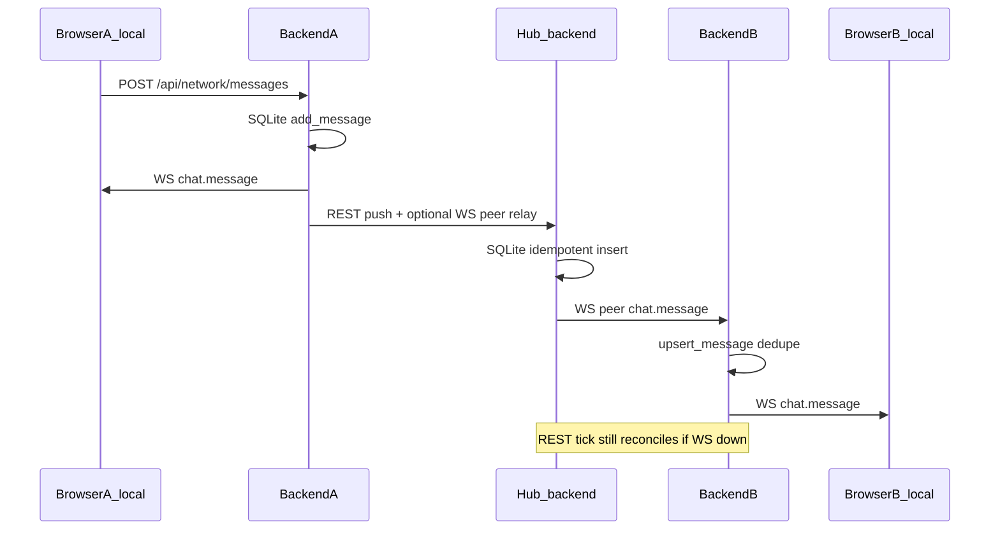

# Phase 0 completion + N1 WS realtime chat

## Current state (verified read-only)

| Item | Status |
|------|--------|
| Branch | [`feature/phase0-lock-retire`](.) @ `cd2c064` (not on `main`) |
| Phase 0 commits done | `6bf7faa` docs lock retire · `a58b9f8` gitignore colmap downloads · `cd2c064` VERSION describe |
| Pending | Staged 4th commit: [`docs/ROADMAP.md`](docs/ROADMAP.md) + [`docs/SKILL_QWEN_LOCAL.md`](docs/SKILL_QWEN_LOCAL.md); background terminal may still be running pre-commit |
| `feature/network-chat-v3.3` | Confirm gone after push (prior delete intended) |

**Phase 0 checkpoint to operator after merge:** short hashes C1–C4, `main` tip, `VERSION` line, confirmation `network-chat-v3.3` absent, doc one-liners in KNOWN_ISSUES/ROADMAP.

---

## Phase 0 — finish (execute first)

1. If pre-commit still running, wait for completion; if 4th commit failed, re-run commit on staged docs only.
2. Cheap gate: docs-only (no backend unit requirement beyond hook).
3. `git checkout main && git merge --ff-only feature/phase0-lock-retire && git push origin main`.
4. Optional: delete local feature branch after push; verify `git branch -a` has no `network-chat`.

---

## N1 architecture (operator guardrails)



**Rules (locked):**

- Browser connects **only to local** backend: `ws(s)://<local-host>/ws/chat?token=<JWT>` ([`authToken()`](src/store/useMuraveiStore.ts) pattern from [`Viewer.tsx`](src/components/panels/Viewer.tsx) detect WS).
- **Client mode:** backend opens **outbound** peer WS to hub `ws://{server_ip}:{port}/ws/chat?token={hub_token}&peer=1` (JWT from existing hub PIN login in [`network_sync.py`](backend/services/network_sync.py)); hub never trusts peer without operator+ JWT.
- **WS = acceleration;** SQLite + 15s REST worker remain source of truth. Dedupe by message `id` ([`add_message` ON CONFLICT](backend/services/network.py), [`upsert_message` newer-wins](backend/services/network.py)).
- **Single-worker uvicorn** (in-memory registries): document in [`docs/KNOWN_ISSUES.md`](docs/KNOWN_ISSUES.md) + [`docs/ENGINEER_GUIDE.md`](docs/ENGINEER_GUIDE.md).
- **Reconnect:** exponential backoff + jitter, cap 60s; no modal spam when down.
- **Status:** extend [`status_dict()`](backend/services/network_sync.py) → `ws_peer: "connected" | "down"` + `ws_peer_last_error` (nullable); FE calm indicator in [`NetworkPanel.tsx`](src/components/panels/NetworkPanel.tsx) / [`NetworkStatus`](src/store/useNetworkStore.ts) (no blocking modals).
- **Dual-instance E2E (<2s WS, tick fallback, single row):** implement relay path in N1; **automated latency + port-block fallback** land in **V1** (extend [`dual_network_smoke.py`](backend/scripts/dual_network_smoke.py) per full-build N6/V1 — not a merge blocker for N1 if unit relay tests pass).

**Wire protocol (JSON text):**

- Hub → all: `{ "type": "chat.message", "message": { id, created_at, direction, sender, body, ... } }`
- Peer → hub (after connect): `{ "type": "peer.hello", "base_id", "base_name" }` then relay `{ "type": "chat.message", "message": ... }`
- Hub on peer `chat.message`: idempotent persist (same fields as REST [`post_message`](backend/api/network.py)), relay to **browser registry** + **other peers** (exclude sender `base_id`).

**Acceleration hooks:**

- After local [`post_message`](backend/api/network.py): `emit_local_browsers(message)` + schedule immediate `push_local_messages()` (don’t wait for 15s tick only).
- After [`pull_remote_messages`](backend/services/network_sync.py) upsert: `emit_local_browsers(message)` for each new incoming row.
- Hub [`post_message`](backend/api/network.py) (remote client REST): persist + relay browsers + peers.

---

## N1 implementation map

| Area | File(s) | Action |
|------|---------|--------|
| Hub registry + relay | New [`backend/services/chat_ws.py`](backend/services/chat_ws.py) | `BrowserRegistry`, `PeerRegistry`, `broadcast_chat_message`, `relay_from_peer`, thread-safe asyncio lock; `notify_local_ui(message)` helper |
| WS route | New [`backend/api/ws_chat.py`](backend/api/ws_chat.py) or extend [`backend/api/network.py`](backend/api/network.py) | `@router.websocket("/ws/chat")` **no** `/api/network` prefix — mirror [`detect.py`](backend/api/detect.py) (`include_router` in [`main.py`](backend/main.py)); auth via [`ws_user`](backend/services/security.py) + `require_role` operator minimum; `peer=1` query → peer path + hello handshake |
| REST integration | [`backend/api/network.py`](backend/api/network.py) | Call relay after `add_message` on POST |
| Peer client | [`backend/services/network_sync.py`](backend/services/network_sync.py) | `ChatPeerClient` task: connect when `mode==client`, backoff 1s→60s+jitter, ingest `chat.message` → `net.upsert_message` → local browser broadcast; update `ws_peer` state |
| Status API | [`backend/services/network_sync.py`](backend/services/network_sync.py) + [`src/store/useNetworkStore.ts`](src/store/useNetworkStore.ts) | Expose `ws_peer`, `ws_peer_last_error`; type on `NetworkStatus` |
| Frontend WS | [`src/store/useNetworkStore.ts`](src/store/useNetworkStore.ts) | `connectChatSocket` / `disconnectChatSocket` when `config.mode !== 'off'` + auth; merge by `id`; bump unread on `direction==='in'`; keep 5s/10s poll as backup (can soften interval when WS `OPEN`) |
| Lifecycle | [`src/App.tsx`](src/App.tsx) or store `loadConfig` | Connect/disconnect on mode/auth changes |
| Tests | New [`backend/tests/test_chat_ws.py`](backend/tests/test_chat_ws.py) | TestClient WS: no token / bad token → 4401; good token accepts; two browser sockets receive `notify`; peer without JWT rejected; peer relay mocked |
| Docs | [`docs/API.md`](docs/API.md), [`docs/NETWORK_REPLICATION.md`](docs/NETWORK_REPLICATION.md), [`docs/KNOWN_ISSUES.md`](docs/KNOWN_ISSUES.md), [`docs/OPERATOR_GUIDE.md`](docs/OPERATOR_GUIDE.md), [`docs/FEATURES.md`](docs/FEATURES.md) if needed | WS endpoint, peer leg, ws_peer, single-worker note; remove “deferred WS” where obsolete |

**Branch:** `feature/n1-ws-chat` from updated `main`.

**Commits (suggested):**

1. `feat(network): WS realtime chat hub relay and local UI`
2. `feat(network): backend peer WS client and ws_peer status` (can squash to one if preferred)
3. `test(network): chat WS auth and relay`
4. `docs: WS realtime chat and network status ws_peer`

**Cheap gates before ff-merge:**

```powershell
$env:PYTHONPATH = "backend"
.\muravei_env\Scripts\python.exe -m unittest backend.tests.test_chat_ws backend.tests.test_network_messages -v
npx tsc --noEmit
# hardcode scan on touched files
```

Then `git merge --ff-only feature/n1-ws-chat` + push `main`.

---

## Out of scope for N1 (later phases)

- N2 attachments, N3 refs, chunked bytes — WS carries `attachment_id` only later.
- Full dual_network_smoke latency assertions — **V1/N6** (path must exist after N1).
- Playwright E2E for chat UI — optional; not required for N1 cheap gate.

---

## Risk notes

- **HTTPException in `ws_user`:** prefer detect-style try/`decode_token` + close 4401 in WS handler (avoid raising HTTPException inside WS).
- **Hub POST direction:** today remote pushes use `direction="out"` on hub DB; UI lists all messages — keep behavior; incoming on clients stays `upsert_message` → `direction=in`.
- **401 on peer WS:** refresh hub token via existing `login_to_hub(force=True)` before reconnect.
