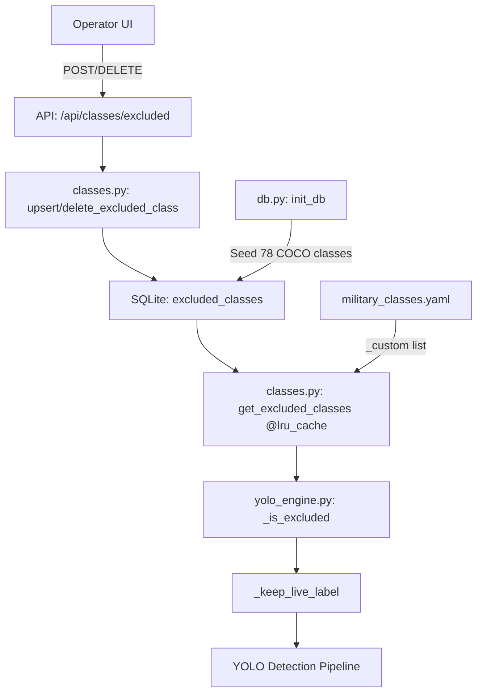

# План реализации P0-1: Динамические excluded classes

**Статус:** ✅ Утверждён  
**Приоритет:** P0 (Критический)  
**Оценка:** 6 часов  
**Роль:** Engineer (доступ через API)  
**Файлы:** `backend/services/db.py`, `backend/services/classes.py`, `backend/services/yolo_engine.py`, `backend/api/classes_api.py`

---

## 1. Problem Statement

**Проблема:** Список `_COCO_DROP` (78 классов) жёстко закодирован в `yolo_engine.py` (строки 67-133).  
**Последствия:**
- Для добавления нового исключённого класса требуется правка кода и рестарт сервиса.
- Невозможность оперативной фильтрации ложных срабатываний оператором.
- Конфликты между COCO-классами (например, `bottle`) и military-классами (`plastic bottle`).

**Цель:** Переместить управление исключёнными классами в SQLite + YAML с возможностью редактирования через API без рестарта системы.

---

## 2. Architecture



### Ключевые решения
1. **Хранение:** SQLite таблица `excluded_classes` с метаданными (source, added_by, added_at).
2. **Кэширование:** `@lru_cache(maxsize=1)` на загрузку списка исключений для производительности.
3. **Инвалидация:** Явный сброс кэша при изменении через API.
4. **Fallback:** При ошибке БД — пустой set (безопасная деградация).
5. **Роли:** Только роль `engineer` может управлять списком.

---

## 3. Implementation Steps

### Шаг 1: База данных (`backend/services/db.py`)

#### 1.1 Схема таблицы
Добавить в `init_db()` после создания `class_overrides`:

```sql
CREATE TABLE IF NOT EXISTS excluded_classes (
    class_name TEXT PRIMARY KEY,
    source TEXT NOT NULL DEFAULT 'yaml',      -- 'yaml' | 'operator'
    added_by TEXT NOT NULL DEFAULT 'system',  -- username
    added_at REAL NOT NULL DEFAULT 0,         -- timestamp
    notes TEXT NOT NULL DEFAULT ''
);
```

#### 1.2 Функции управления
```python
def list_excluded_classes() -> list[dict[str, Any]]:
    """Return all excluded classes with metadata."""
    conn = _connect()
    try:
        rows = conn.execute(
            "SELECT class_name, source, added_by, added_at, notes "
            "FROM excluded_classes ORDER BY source, class_name"
        ).fetchall()
        return [dict(r) for r in rows]
    finally:
        conn.close()

def upsert_excluded_class(
    class_name: str,
    source: str = "operator",
    added_by: str = "system",
    notes: str = "",
) -> dict[str, Any]:
    """Add or update an excluded class."""
    conn = _connect()
    try:
        conn.execute(
            """INSERT OR REPLACE INTO excluded_classes 
               (class_name, source, added_by, added_at, notes)
               VALUES (?, ?, ?, ?, ?)""",
            (class_name.lower(), source, added_by, time.time(), notes),
        )
        conn.commit()
        return {"class_name": class_name.lower(), "source": source, "added_by": added_by}
    finally:
        conn.close()

def delete_excluded_class(class_name: str) -> bool:
    """Remove an excluded class."""
    conn = _connect()
    try:
        cursor = conn.execute(
            "DELETE FROM excluded_classes WHERE class_name = ?",
            (class_name.lower(),),
        )
        conn.commit()
        return cursor.rowcount > 0
    finally:
        conn.close()
```

#### 1.3 Seed данных (COCO builtins)
В `init_db()` после `CREATE TABLE`:

```python
_coco_builtins = [
    "frisbee", "sports_ball", "dog", "cat", "horse", "sheep", "cow",
    "umbrella", "handbag", "suitcase", "skis", "snowboard", "skateboard",
    "surfboard", "bottle", "cup", "chair", "bench", "tv", "laptop",
    "cell phone", "keyboard", "mouse", "remote", "book", "clock",
    "vase", "scissors", "teddy bear", "hair drier", "toothbrush",
    "stop sign", "parking meter", "traffic light", "fire hydrant",
    "potted plant", "dining table", "toilet", "sink", "refrigerator",
    "microwave", "oven", "toaster", "couch", "bed", "wine glass",
    "fork", "knife", "spoon", "bowl", "banana", "apple", "sandwich",
    "orange", "broccoli", "carrot", "hot dog", "pizza", "donut", "cake",
    "tie", "backpack",
]
for name in _coco_builtins:
    conn.execute(
        "INSERT OR IGNORE INTO excluded_classes (class_name, source, added_by, added_at, notes) "
        "VALUES (?, 'yaml', 'system', 0, 'Built-in COCO clutter')",
        (name,),
    )
conn.commit()
```

---

### Шаг 2: Сервис классов (`backend/services/classes.py`)

#### 2.1 Функция загрузки исключений
Добавить после `get_class_catalog()`:

```python
@functools.lru_cache(maxsize=1)
def get_excluded_classes() -> set[str]:
    """Load excluded classes from SQLite + YAML. Cached until invalidation."""
    excluded: set[str] = set()
    
    # 1. SQLite (operator-defined + YAML seed)
    try:
        from services.db import list_excluded_classes
        for row in list_excluded_classes():
            # Normalize: lowercase, spaces to underscores
            excluded.add(row["class_name"].lower().replace(" ", "_"))
    except Exception:  # noqa: BLE001
        pass  # Fallback: empty set (safe degradation)
    
    # 2. YAML custom exclusions (military_classes.yaml: _custom)
    raw = _load_yaml()
    yaml_custom = raw.get("_custom", []) or []
    for name in yaml_custom:
        excluded.add(name.lower().replace(" ", "_"))
    
    return excluded


def invalidate_excluded_cache() -> None:
    """Drop excluded classes cache after operator changes."""
    get_excluded_classes.cache_clear()
```

#### 2.2 Обновление `invalidate_class_cache()`
```python
def invalidate_class_cache() -> None:
    """Drop in-memory catalog after SYSTEM dictionary edits."""
    global _catalog, _by_id, _alias_map, _disabled_ids
    _catalog = None
    _by_id = None
    _alias_map = None
    _disabled_ids = None
    invalidate_excluded_cache()  # NEW: also clear excluded cache
```

---

### Шаг 3: YOLO Engine (`backend/services/yolo_engine.py`)

#### 3.1 Удалить хардкод
**Удалить полностью** блок `_COCO_DROP = (...)` (строки 67-133).

#### 3.2 Обновить логику фильтрации
Заменить функцию `_keep_live_label`:

```python
# OLD implementation removed

@functools.lru_cache(maxsize=256)
def _is_excluded(name: str) -> bool:
    """Check if a class name is in the excluded list."""
    from services.classes import get_excluded_classes
    excluded = get_excluded_classes()
    blob = (name or "").lower().replace("-", " ").replace("_", " ")
    return any(tok in blob for tok in excluded)


def _keep_live_label(name: str) -> bool:
    """Return True if label should be kept in live detections."""
    if _is_excluded(name):
        return False
    return is_catalog_label(name)
```

**Примечание:** `_is_excluded` использует свой кэш (maxsize=256) для быстрых проверок во время детекции, а `get_excluded_classes` кэширует загрузку из БД (maxsize=1).

---

### Шаг 4: API Endpoints (`backend/api/classes_api.py`)

#### 4.1 Модели данных
```python
class ExcludedClassBody(BaseModel):
    class_name: str = Field(..., min_length=1, max_length=100)
    notes: str = Field(default="", max_length=500)
```

#### 4.2 Эндпоинты
Добавить после существующих роутов:

```python
from services.db import (
    list_excluded_classes,
    upsert_excluded_class,
    delete_excluded_class,
)
from services.classes import invalidate_excluded_cache


@router.get("/excluded")
async def classes_excluded_list(
    _user: dict[str, Any] = Depends(require_role("engineer")),
) -> dict[str, Any]:
    """List all excluded classes (COCO builtins + operator-defined)."""
    return {"excluded": list_excluded_classes()}


@router.post("/excluded")
async def classes_excluded_add(
    body: ExcludedClassBody,
    user: dict[str, Any] = Depends(require_role("engineer")),
) -> dict[str, Any]:
    """Add a new excluded class."""
    upsert_excluded_class(
        class_name=body.class_name,
        source="operator",
        added_by=user.get("username", "system"),
        notes=body.notes,
    )
    invalidate_excluded_cache()
    # Refresh response validator if available
    try:
        from services.response_validator import get_validator
        get_validator().refresh_catalog()
    except Exception as exc:  # noqa: BLE001
        print(f"[CLASSES] validator refresh failed: {exc}")
    return {"ok": True, "class_name": body.class_name.lower()}


@router.delete("/excluded/{class_name}")
async def classes_excluded_delete(
    class_name: str,
    user: dict[str, Any] = Depends(require_role("engineer")),
) -> dict[str, Any]:
    """Remove an excluded class."""
    deleted = delete_excluded_class(class_name)
    if deleted:
        invalidate_excluded_cache()
        try:
            from services.response_validator import get_validator
            get_validator().refresh_catalog()
        except Exception as exc:  # noqa: BLE001
            print(f"[CLASSES] validator refresh failed: {exc}")
    return {"ok": True, "deleted": deleted}
```

---

## 4. Testing

### Smoke Tests

```bash
# 1. Проверка seed COCO-классов
python -c "
from services.db import list_excluded_classes
excl = list_excluded_classes()
print(f'Excluded: {len(excl)} classes')
assert len(excl) >= 78, 'COCO seed failed'
assert any(e['class_name'] == 'bottle' for e in excl)
assert any(e['class_name'] == 'dog' for e in excl)
print('✅ COCO seed OK')
"

# 2. Добавление через API (требуется токен engineer)
curl -X POST http://localhost:8000/api/classes/excluded \
  -H "Content-Type: application/json" \
  -H "Authorization: Bearer <engineer_token>" \
  -d '{"class_name": "fake_soldier", "notes": "Test exclusion"}'

# 3. Проверка кэша
python -c "
from services.classes import get_excluded_classes
excl = get_excluded_classes()
assert 'fake_soldier' in excl
print('✅ Operator exclusion OK')
"

# 4. Удаление через API
curl -X DELETE http://localhost:8000/api/classes/excluded/fake_soldier \
  -H "Authorization: Bearer <engineer_token>"

# 5. Проверка удаления
python -c "
from services.classes import get_excluded_classes, invalidate_excluded_cache
invalidate_excluded_cache()  # Force reload
excl = get_excluded_classes()
assert 'fake_soldier' not in excl
print('✅ Deletion OK')
"

# 6. Интеграция с YOLO
python -c "
from services.yolo_engine import _keep_live_label
assert _keep_live_label('dog') == False, 'dog should be excluded'
assert _keep_live_label('tank') == True, 'tank should be kept'
print('✅ YOLO integration OK')
"
```

### Edge Cases
- [ ] Пустая БД → fallback на пустой set
- [ ] Special characters в названии класса
- [ ] Duplicate insert (UPSERT работает корректно)
- [ ] Concurrent modifications (SQLite locking)
- [ ] Cache invalidation при одновременных запросах

---

## 5. Acceptance Criteria

- [ ] Таблица `excluded_classes` создана в SQLite при `init_db()`
- [ ] 78 COCO-классов автоматически seed-ятся при первой инициализации
- [ ] API `/api/classes/excluded` поддерживает GET, POST, DELETE
- [ ] Доступ только для роли `engineer`
- [ ] Оператор может добавлять/удалять классы через UI/API
- [ ] Изменения применяются мгновенно (cache invalidation)
- [ ] `_keep_live_label()` использует динамический список из БД
- [ ] Все smoke tests прошли успешно
- [ ] Нет регрессии в производительности детекции (кэш работает)

---

## 6. Rollback Plan

**Сценарий:** Критическая ошибка в SQLite или кэшировании.

**Действия:**
1. Закомментировать вызовы `list_excluded_classes()` в `get_excluded_classes()`.
2. Функция вернёт пустой set → все классы станут видимыми.
3. Это безопасно: COCO-мусор появится в детекциях, но система не упадёт.

**Команда отката:**
```bash
git revert <commit-hash-p0-1>
# Перезапуск backend
docker-compose restart backend
```

---

## 7. Metrics & Monitoring

После внедрения добавить метрики:
- `excluded_classes_count` (gauge) — количество исключённых классов
- `excluded_detections_rate` (counter) — сколько детекций отфильтровано
- `cache_hit_rate` (gauge) — эффективность LRU-кэша

Пример для Prometheus:
```python
from prometheus_client import Gauge
EXCLUDED_COUNT = Gauge('excluded_classes_count', 'Number of excluded classes')

def get_excluded_classes():
    # ... existing logic ...
    EXCLUDED_COUNT.set(len(excluded))
    return excluded
```

---

## 8. Timeline

| Этап | Длительность | Статус |
|------|--------------|--------|
| 1. DB schema + seed | 1ч | ⏳ Ожидает |
| 2. classes.py логика | 1.5ч | ⏳ Ожидает |
| 3. yolo_engine.py интеграция | 1ч | ⏳ Ожидает |
| 4. API endpoints | 1.5ч | ⏳ Ожидает |
| 5. Тестирование | 1ч | ⏳ Ожидает |
| **Итого** | **6ч** | |

---

## Appendix: Full COCO Drop List (78 classes)

```python
_coco_builtins = [
    "frisbee", "sports_ball", "dog", "cat", "horse", "sheep", "cow",
    "umbrella", "handbag", "suitcase", "skis", "snowboard", "skateboard",
    "surfboard", "bottle", "cup", "chair", "bench", "tv", "laptop",
    "cell phone", "keyboard", "mouse", "remote", "book", "clock",
    "vase", "scissors", "teddy bear", "hair drier", "toothbrush",
    "stop sign", "parking meter", "traffic light", "fire hydrant",
    "potted plant", "dining table", "toilet", "sink", "refrigerator",
    "microwave", "oven", "toaster", "couch", "bed", "wine glass",
    "fork", "knife", "spoon", "bowl", "banana", "apple", "sandwich",
    "orange", "broccoli", "carrot", "hot dog", "pizza", "donut", "cake",
    "tie", "backpack",
]
```
