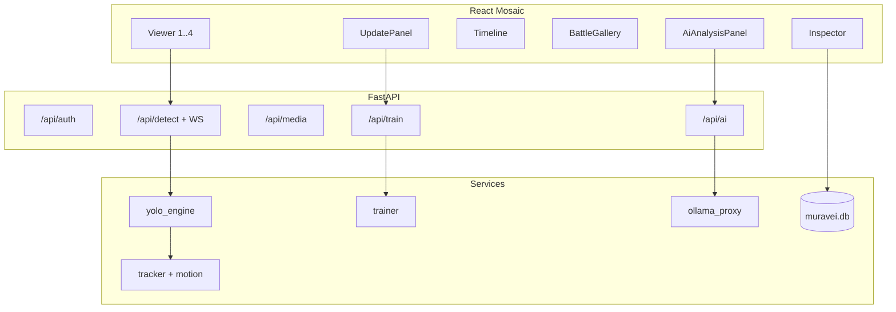

# Архитектура MuraveiVision PRO

Единый документ: **часть A** — слои и потоки для инженера; **часть B** — инварианты для ИИ-агентов. Старый [`ARCHITECTURE_FOR_AI.md`](ARCHITECTURE_FOR_AI.md) — только перенаправление сюда.

---

# Часть A. Архитектура

## Обзор

Локальный монолит: браузерный (или pywebview) UI ↔ FastAPI на `127.0.0.1:8000` ↔ GPU/CPU инференс + SQLite + опционально Ollama.



## Слои

### Presentation

- `src/App.tsx` — mosaic layout, режимы TopBar.
- Панели в `src/components/panels/`. Тяжёлые (Flight3D, Admin, Network, AI, Train, Debug, Gallery) — `React.lazy` в `ComponentRegistry`.
- Состояние: `src/store/useMuraveiStore.ts`, `usePanelLayoutStore.ts` (persist layout).
- Тема: тёмный DaVinci-подобный chrome (плоские панели, акценты playhead).

### Application API

Роутеры `backend/api/*`, подключаются из `backend/main.py`.

Основные группы: auth, media, detect (+ WS), detections, train/export, ai, live, rec, reports, models (вкл. USB), system, network, events, classes, queue, recon, support, seg (архив).

### Domain services

| Сервис | Роль |
|--------|------|
| `yolo_engine.py` | загрузка весов, predict, tile/NMS, device tier |
| `segmentation_engine.py` | archive-only YOLO26-seg (маски), не пишет detections |
| `tracker.py` / `motion.py` | track_id, vx/vy, ego-motion |
| `trainer.py` | quick finetune + SSE |
| `classes.py` | 238 YAML + overrides |
| `similarity.py` | find-similar: CLIP image + hist fallback, кэш SQLite |
| `ollama_proxy.py` | tags/generate, ranking vision/chat |
| `live_stream.py` / `recorder.py` | RTSP/UDP + REC |
| `reporter.py` | автономный HTML-отчёт |
| `db.py` | detections, crops, embeddings, auth, network, overrides |
| `network_sync.py` | клиентский worker хаба |
| `usb_models.py` | сканирование USB + безопасный импорт `.pt`/YAML |
| `telemetry.py` | SRT/CSV → трек, `attach_gps` / backfill на детекциях |

### Data

- `muravei.db` — оперативные данные.
- `archive/` — исходные медиа и артефакты.
- `assets/models/` — веса detect (`yolo26n-ft.pt` — активная голова).
- `cache/` — временные train/scan датасеты.
- `logs/` — диагностика.

## Потоки данных

### Live / Viewer frame

```
Viewer JPEG → WS /ws/detect/{viewer_id}
  → yolo_engine.infer
  → tracker + motion
  → overlay JSON (objects, tracks, ego, ms)
```

### Фиксация

```
Commit detections → POST /api/detections/commit
  → attach_gps (SRT/CSV / flight_tracks)
  → crops JPEG + SQLite rows
  → BattleGallery / train dataset
```

### Дообучение

```
UpdatePanel → POST /api/train/start {epochs, imgsz, batch, resume_from?}
  → trainer (detect-only, empty_cache)
  → ultralytics.train(resume=True | fresh)
  → promote yolo26n-ft.pt → force_load
```

### AI analysis

```
AiAnalysisPanel / Inspector → POST /api/ai/analyze
  → ollama_proxy → localhost:11434
```

## UI mosaic

Листья (leaf ids) регистрируются в `ComponentRegistry`. Оператор перетаскивает панели, сохраняет layout в localStorage. Пресеты TopBar меняют дерево целиком (Медиа, Монтаж, AI-анализ, Обучение, 4×Live, Система).

Viewer поддерживает до 4 инстансов, Архив|Live, pan/zoom, bbox edit, REC, compare Было/Стало.

## Безопасность

- JWT после PIN.
- Relative `/api` пути.
- Ограничение FS к `archive/` (медиа); USB-импорт — только removable root.
- Portable CSP meta в `dist/index.html`.

## Что не является частью текущего PRO

- Отдельная папка `models/*.onnx` как единственный runtime (legacy backup).
- Режимы MiniMode / Workspace 4×4 из старого PROJECT_CONTEXT.
- Облачные LLM.

---

# Часть B. Инварианты для ИИ-агентов

Как устроена система **сейчас** и что агент обязан соблюдать при правках.

## 1. Принципы

1. **Air-gap first** — нет обязательных внешних вызовов в рантайме оператора. Сборка Portable может качать embeddable Python только на машине сборки.
2. **Monolith local** — один FastAPI-процесс + статика `dist/` (или Vite dev). UI не ходит на `:11434` напрямую.
3. **Mosaic IDE** — раскладка `react-mosaic-component`, не фиксированный Mini/Pro из legacy.
4. **Detect ≠ Segment** — быстрое обучение и `yolo26n-ft` — box-detect; YOLOE-seg не использовать как train base. Archive-only сегментация (`segmentation_engine.py`, веса `yolo26n-seg.pt` / `yolo26s-seg.pt`) не грузится в `yolo_engine` / `trainer`, не пишет SQLite detections. Нет файла или модель не в VRAM → `POST /api/seg/infer` = 503, детекция без изменений. Явные `load`/`unload`.

## 2. Инференс (обязательное поведение)

Файл: `backend/services/yolo_engine.py`.

- Очередь кадров, защита OOM, адаптивный `imgsz` по tier устройства.
- Порядок весов: при наличии `assets/models/yolo26n-ft.pt` — **сначала ft** (closed-set); иначе YOLOE при готовом CLIP; иначе nano/best.
- `force_load(path)` — жёсткое переключение после promote / USB-импорта; перед сменой — `torch.cuda.empty_cache()`.
- Primary-first: COCO fallback только если primary вернул пусто.
- Фильтры: drop бытового COCO-мусора; soft conf для LBS-токенов; scene-area лимиты.

Трекинг: `tracker.py` (IoU, без ByteTrack/lap). Эго-motion: `motion.py` (LK optical flow).

## 3. Классы

- Источник правды имён: `military_classes.yaml` (238) в корне репо (`services/classes.py` → `YAML_PATH`).
- Overrides: SQLite `class_overrides` + UI `ClassDictionary` / `/api/classes/*`.
- Маппинг model index → UI snake_case: `classes.py` (`to_snake_case`, aliases, disabled).
- Кэш валидатора: `refresh_catalog()` мгновенный; иначе TTL 300 с.

## 4. Обучение

Файл: `backend/services/trainer.py`.

- Датасет из сохранённых кропов (почти full-frame YOLO lines).
- Base: `yolo26n.pt` / `yolo26n-ft.pt` (detect-only).
- Device: CUDA `0` если `torch.cuda.is_available()`, иначе CPU.
- Promote → `assets/models/yolo26n-ft.pt` + mirror в `runs/.../weights/` + `force_load`.
- Офлайн скрипты: `backend/scripts/systematize_backup_finetune.py`, `autolabel_train_lbs_video.py`, `smoke_lbs_ft.py`.

На RTX 5060 Laptop (8 GB): безопаснее `imgsz=640`, batch 4/2/1 + `empty_cache` между ретраями.

## 5. Сеть (тактическая)

`backend/api/network.py` + `services/network.py` + `services/network_sync.py`: server/client/off, JWT на хаб, heartbeat, targets (GPS, `source_video`), чат.

Клиентский worker (тик 30 с) стартует из `main.py` lifespan всегда; no-op если `mode != client`. `POST /targets` пишет только `direction=out`. Входящие — upsert newer-wins (`direction=in`). Skip self по `source_base` == `base_id` или `base_name`. Инкрементальный pull: `GET /targets?since=`.

Один процесс / одна SQLite **не** проверяет репликацию — две копии каталога, см. [ENGINEER_GUIDE.md](ENGINEER_GUIDE.md#сеть-баз). 4×Live / Event Timeline: `GET /api/events/timeline` + вкладка `liveQuad`.

## 6. Правила генерации кода

1. Правки минимальные, в стиле соседнего кода; без «великих» рефакторингов без запроса.
2. TypeScript строго; типы в `src/types/muravei.ts` и stores.
3. Не ломать CSP в `dist/index.html` (portable проверяет наличие CSP).
4. Не добавлять зависимости, требующие Python ≥3.13.
5. После `pip install` — только `muravei_env\Scripts\python.exe` / `pip.exe`; проверить `sys.version` (3.12) и `pip check`.
6. Документацию класть в `docs/`, не размазывать по корню.
7. Не цитировать и не «оживлять» устаревший `.backup/.../PROJECT_CONTEXT.md` (фальшивые пути `models/*.onnx`, MiniMode и т.д.).

## 7. Запреты безопасности

- Не логировать PIN в открытом виде в долгоживущие логи.
- Path traversal: медиа только под `archive/` (`security.py` / `trash.py`).
- Diagnostic ZIP без секретов PIN (`support.py`).

## 8. Smoke / проверка после крупных правок

```powershell
.\muravei_env\Scripts\python.exe -c "import torch; print(torch.__version__, torch.cuda.is_available())"
.\muravei_env\Scripts\python.exe backend\scripts\smoke_lbs_ft.py
npm run smoke:phase3
npm run smoke:phase4
npm run test
```
