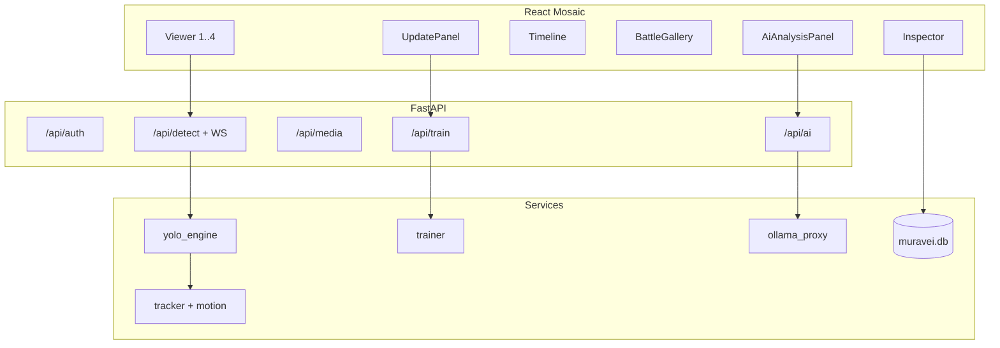

# ARCHITECTURE_FOR_AI — регламент для ИИ-агентов

Инженерный манифест: как устроена система **сейчас** и что агент обязан соблюдать при правках.

## 1. Принципы

1. **Air-gap first** — нет обязательных внешних вызовов в рантайме оператора. Сборка Portable может качать embeddable Python только на машине сборки.
2. **Monolith local** — один FastAPI-процесс + статика `dist/` (или Vite dev). UI не ходит на `:11434` напрямую.
3. **Mosaic IDE** — раскладка `react-mosaic-component`, не фиксированный Mini/Pro из legacy.
4. **Detect ≠ Segment** — быстрое обучение и `yolo26n-ft` — box-detect; YOLOE-seg не использовать как train base.

## 2. Слои



## 3. Инференс (обязательное поведение)

Файл: `backend/services/yolo_engine.py`.

- Очередь кадров, защита OOM, адаптивный `imgsz` по tier устройства.
- Порядок весов: при наличии `assets/models/yolo26n-ft.pt` — **сначала ft** (closed-set); иначе YOLOE при готовом CLIP; иначе nano/best.
- `force_load(path)` — жёсткое переключение после promote.
- Primary-first: COCO fallback только если primary вернул пусто.
- Фильтры: drop бытового COCO-мусора; soft conf для LBS-токенов; scene-area лимиты.

Трекинг: `tracker.py` (IoU, без ByteTrack/lap). Эго-motion: `motion.py` (LK optical flow).

## 4. Классы

- Источник правды имён: `military_classes.yaml` (238).
- Overrides: SQLite `class_overrides` + UI `ClassDictionary` / `/api/classes/*`.
- Маппинг model index → UI snake_case: `classes.py` (`to_snake_case`, aliases, disabled).

## 5. Обучение

Файл: `backend/services/trainer.py`.

- Датасет из сохранённых кропов (почти full-frame YOLO lines).
- Base: `yolo26n.pt` / `yolo26n-ft.pt` (detect-only).
- Device: CUDA `0` если `torch.cuda.is_available()`, иначе CPU.
- Promote → `assets/models/yolo26n-ft.pt` + mirror в `runs/.../weights/` + `force_load`.
- Офлайн скрипты: `backend/scripts/systematize_backup_finetune.py`, `autolabel_train_lbs_video.py`, `smoke_lbs_ft.py`.

На RTX 5060 Laptop (8 GB): безопаснее `imgsz=640`, batch 4/2/1 + `empty_cache` между ретраями.

## 6. Сеть (тактическая)

`backend/api/network.py` + `services/network.py` + `services/network_sync.py`: server/client/off, JWT на хаб, heartbeat, targets (GPS, `source_video`), чат.

Клиентский worker (тик 30 с) стартует из `main.py` lifespan всегда; no-op если `mode != client`. `POST /targets` пишет только `direction=out`. Входящие — upsert newer-wins (`direction=in`). Skip self по `source_base` == `base_id` или `base_name`. Инкрементальный pull: `GET /targets?since=`.

Один процесс / одна SQLite **не** проверяет репликацию — две копии каталога, см. [ENGINEER_GUIDE.md](ENGINEER_GUIDE.md#сеть-баз). 4×Live / Event Timeline — отдельно, [TODO.md](TODO.md).

## 7. Правила генерации кода

1. Правки минимальные, в стиле соседнего кода; без «великих» рефакторингов без запроса.
2. TypeScript строго; типы в `src/types/muravei.ts` и stores.
3. Не ломать CSP в `dist/index.html` (portable проверяет наличие CSP).
4. Не добавлять зависимости, требующие Python ≥3.13.
5. После `pip install` — `python -c "import sys; print(sys.version)"` и `pip check`.
6. Документацию класть в `docs/`, не размазывать по корню.
7. Не цитировать и не «оживлять» устаревший `.backup/.../PROJECT_CONTEXT.md` (фальшивые пути `models/*.onnx`, MiniMode и т.д.).

## 8. Запреты безопасности

- Не логировать PIN в открытом виде в долгоживущие логи.
- Path traversal: медиа только под `archive/` (`security.py` / `trash.py`).
- Diagnostic ZIP без секретов PIN (`support.py`).

## 9. Smoke / проверка после крупных правок

```powershell
.\muravei_env\Scripts\python.exe -c "import torch; print(torch.__version__, torch.cuda.is_available())"
.\muravei_env\Scripts\python.exe backend\scripts\smoke_lbs_ft.py
npm run smoke:phase3
npm run smoke:phase4
```
