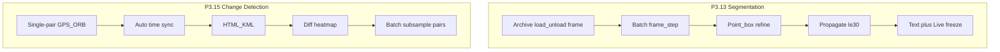

# MuraveiVision PRO — Master Plan

## Meta

- **Snapshot date:** 2026-09-05
- **Branch:** `feature/alicevision-v3.2`
- **Commit:** (pending) — ensure COLMAP TXT before AliceVision Dense
- **Unit tests:** 250 OK
- **E2E specs:** 6+
- **Status:** v3.2.0-rc.1; job `d93931cbdc5a` colmap_done — ready for Dense; **do not merge to main**
- **Last updated by:** fix: auto model_converter for AliceVision Dense
- **Portable artifacts:** Mini ~0.54 GB (no AV); FullKit+AV ~17.8 GB (`MuraveiVision_PRO_FullKit.zip`)
- **Isolated test copy:** `MuraveiVision-Pro-3.2.0/` on :8001/:3001 (gitignored)

## Major Changes in This Release

- AliceVision optional dense MVS + textured mesh after COLMAP sparse
- Preset hierarchy Sparse / Dense / Mesh / Splat (+ aliases)
- Flight3D multi-artifact viewer + export
- FullKit `-IncludeAliceVision` portable bundling
- 3D Reconstruction: COLMAP sequential matching + frame budget (stable on 8GB VRAM)
- HUD Exclusion: Auto-detection + blur/crop for detect/CD/recon
- Session Trace: Page-lifetime singleton + sessionStorage UUID
- Media Paths: Canonical `archive/...` paths, no hardcoded `D:\` paths
- CSP Security: `blob:` support for 3D splat
- Zero-Hardcode Policy: Systematic scan + durable Cursor rule
- Portable build hardening: unique `stage_*`, host-pip bake, offline wheels, stable CA bundle
- Network Replication 3.1: multi-machine target sync via JWT
- Phase 3 closed: Batch Seg / SAM3 / Change Detection v3 (incl. Batch CD)

---

## 1. Северная звезда

Полевой **тактический ПАК** на edge-ноутбуке (часто 8 ГБ VRAM): архив + Live, YOLO-детекция, гео, отчёты, обучение, air-gap portable — **без моков в проде**, только `muravei_env` Python **3.12.10**.

Источники замысла: PDF v3.0 → планы `muraveivision_pro_roadmap` → `masterplan_field_readiness` → `masterplan_v3_*` → Phase 3 (P3.13 / P3.15).

---

## 2. Архитектурные инварианты

| Инвариант | Смысл |
|-----------|--------|
| Detect ≠ YOLO-seg ≠ SAM3 ≠ Change Detection | Отдельные контуры, не смешивать веса/VRAM |
| Archive vs Live | Seg/SAM/Batch CD — в основном архив; Live SAM только freeze-frame |
| Ephemeral vs persistent | Batch seg / Batch CD / propagate по умолчанию in-memory |
| JWT + `downloadAuthorized` | Экспорты не через «голые» URL |
| Reuse before invent | hardware, `list_detections`, `auto_sync`, batch_seg job pattern |

Подробнее для агентов: [ARCHITECTURE.md](ARCHITECTURE.md) (часть B).

---

## 3. Закрытые эпохи

### A. Фундамент и полевой цикл

- Roadmap / gap inventory / Phase 3 field-ready (Ollama, HTML-отчёт, Обновление, REC, ZIP)
- Detection accuracy (primary-first YOLO26, always-on, scrub gates, словарь)
- UI clarity / Inspector folds / scrub–seek–Play / compare Sync
- **Sprint A.1** batch scan → timeline
- **A.4** Geo SRT/CSV → `flight_tracks` + `gps_*`
- **B.1** Flight3D · **B.2** FullKit (Ollama в portable)
- COLMAP + gsplat + raycast (Sprint C)
- Docs overhaul, SAHI, Response Validator + catalog TTL
- Masterplan v3 Stage 1 (hotkeys, KML/GeoJSON, audio cues)
- Network replication 3.1 (ветка `feature/network-replication-3.1`)
- Frontend code-split 5.1 · find-similar CLIP (P1.6)

### B. Phase 3 / «Фаза 4» в docs = P3.13 + P3.15

| ID | Содержание | Статус |
|----|------------|--------|
| P3.13 / VRAM UI | Archive seg + load/unload | DONE |
| P3.13.2 | Batch Segmentation | DONE |
| P3.13.3a–c | SAM3 refine / propagate / text+Live | DONE |
| P3.15.1–.4 | CD + sync + export + heatmap | DONE |
| P3.15.5 | Batch Change Detection | DONE (`03f8488`) |
| CSV + VRAM UI | TopBar + Inspector CSV | DONE (`ec6cf92`) |
| Offline map tiles | Air-gap HTML | DONE (`f9b8d2d`) |
| Real video smoke / Playwright E2E | | DONE |

**Итог:** продуктовый контур P0–P3 и весь P3.15 (включая Batch CD) — **закрыт**.

---

## 4. Текущая точка

- **Ветка:** `feature/network-replication-3.1`
- **Последние закрытые спринты:** SAM3 point fix → offline maps → CSV + VRAM → **Batch Change Detection**
- **Операторский CD v3:** single-pair → sync → export → heatmap → пакетный subsample

---

## 5. Открытый backlog

### P2 — Performance / поле

- Profiling batch seg / SAM propagate / dual-viewer на **8 ГБ**
- Полевой smoke: archive SAM3 text + Live «Кадр SAM» + Compare + Batch CD на реальных роликах

### По запросу

- GeoTIFF / KML **масок** batch/propagate
- Full-video SAM propagate (сейчас ≤30 кадров)
- Opt-in персистентность Batch CD / CSV batch
- Uniform dual-stream frame_step CD (сознательно **не** в MVP Batch CD)

### Техдолг / UX (если всплывёт)

- Дальнейшие UI-аудиты
- Новые фичи «от пользователей»

См. также [TODO.md](TODO.md) и [ROADMAP.md](ROADMAP.md).

---

## 6. Рекомендуемый порядок следующих спринтов

| # | Спринт | Зачем |
|---|--------|-------|
| 1 | **Field smoke pack** | Подтвердить 8 ГБ + реальные ролики end-to-end |
| 2 | **Perf budget** | ms/VRAM лимиты batch seg / propagate / Batch CD |
| 3 | **Mask export** (по запросу) | GeoTIFF/KML масок |
| 4 | **Persist/opt-in** (по запросу) | SQLite для batch CD / CSV batch |

Не начинать параллельно: новый detect-train путь + SAM continuous Live + dual uniform ORB batch — это ломает инварианты.

---

## 7. Карта исторических планов Cursor (роль)

| Кластер | Примеры планов в `~/.cursor/plans` |
|---------|-------------------------------------|
| Vision / meta | `muraveivision_pro_roadmap`, `full_roadmap_p0-p3`, `masterplan_field_readiness`, `masterplan_status_*` |
| Detect / geo / kit | `detection_accuracy_fix`, `sprint_a1/a4/b1/b2`, `sahi_*`, `response_validator_*` |
| 3D recon | `photogrammetry_*`, `3d_sprint_*`, `meshroom_*`, `recon_ux_*` |
| UI / stability | `ui_clarity_*`, `inspector_*`, `timeline_*`, `video_play_*`, `sprint1_ui_*` |
| Network / v3 stage | `network_replication_3.1`, `masterplan_v3_*` |
| Phase 3 seg+CD | `p3.13_*`, `p3.15_*`, `batch_change_detection_*`, `csv_and_vram_*`, `sam3_point_then_maps_*` |
| Docs / E2E | `documentation_overhaul`, `docs_p3.15_v2_retro`, `playwright_e2e_*`, `phase_4_retrospective` |

---

## 8. Одной фразой

**Сейчас продукт = полевой detect + geo + seg/SAM3 + полный Change Detection v3 + сеть/portable; следующий мастер-фокус — не новые фичи ядра, а полевой smoke и perf на 8 ГБ, остальное — backlog по запросу.**

---

## 9. Documentation Auto-Sync Rules

After every code change (PR/commit), the following docs **MUST** be updated if affected.

### Always check

- [`ROADMAP.md`](ROADMAP.md) — move completed tasks to DONE with commit hash
- [`TODO.md`](TODO.md) — update checklists
- [`API.md`](API.md) — if endpoints added/changed
- [`FEATURES.md`](FEATURES.md) — if new features added
- [`ARCHITECTURE.md`](ARCHITECTURE.md) — if invariants changed
- [`KNOWN_ISSUES.md`](KNOWN_ISSUES.md) — if new limitations discovered
- [`MASTER_PLAN.md`](MASTER_PLAN.md) — update **Meta** (date, commit, test count, status)

### Conditional

- [`ANALYST_GUIDE.md`](ANALYST_GUIDE.md) — if UI workflow changed
- [`ENGINEER_GUIDE.md`](ENGINEER_GUIDE.md) — if deployment/installation changed
- [`ERROR_REFERENCE.md`](ERROR_REFERENCE.md) — if new error codes added

### Never forget

- Update `## Meta` in this file after every sprint
- Cross-reference new docs in relevant sections
- Keep commit hashes accurate

Human checklist: [`DOCS_SYNC_CHECKLIST.md`](DOCS_SYNC_CHECKLIST.md).  
Agent rules: [`.cursorrules`](../.cursorrules) (repo root).

---

## 10. Next Steps (from backlog)

| Priority | Sprint | Why |
|----------|--------|-----|
| 1 | Field smoke pack | Validate 8GB + real videos end-to-end |
| 2 | Perf budget | ms/VRAM limits for batch ops |
| 3 | Mask export (on request) | GeoTIFF/KML for masks |
| 4 | Persist/opt-in (on request) | SQLite for batch CD |
