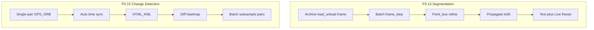

# MuraveiVision PRO — Master Plan

## Meta

- **Snapshot date:** 2026-09-19
- **Branch:** `main`
- **Commit:** HEAD (P0 hotfix + R1-R4 + Atomic Execution)
- **Unit tests:** 407+ (backend suite, pre-commit gate)
- **Status:** P0 (11/11) ✅ + P1 (14/14) ✅ + P0-hotfix ✅ — Startup hardening complete
- **Last updated by:** P0 Hotfix v3.2.0 — Lifespan hardening + single-instance + process cleanup

## P0 Hotfix (2026-09-19)

- **hotfix_p0_startup:** v3.2.0 | 2026-09-19 | P0: ValueError on startup → safe_bool/safe_int + lifespan hardening + single-instance guard + process cleanup
- **Files changed:** config_utils.py, single_instance.py, network.py, network_beacon.py, network_sync.py, ollama_proxy.py, recon_train.py, train_presets.py, main.py, Запустить.bat
- **Tests added:** test_config_utils (7), test_single_instance (2), test_lifespan_hook (3), test_startup_resilience (1)
- **14 locations replaced:** unsafe bool(int(str)) and int(cfg.get) → safe_bool/safe_int
- **Lifespan:** all hooks wrapped in _run_hook(lambda: ...) — non-fatal on failure
- **Single-instance:** lock-file in tempfile + PID file for bat wait_loop
- **Process cleanup:** atexit + SIGINT handler with re-raise (uvicorn graceful Ctrl+C)
- **Docs:** MASTER_PLAN Meta + KNOWN_ISSUES degraded-mode row (file: backend/main.py:_run_hook)
- **Portable size bands (OPERATOR-SANCTIONED 2026-09-16):** Mini warn&gt;4.5 / reject&gt;5; FullKit no-DA3 warn&gt;9.5 / reject&gt;10; FullKit+DA3 (base+large+metric+**giant**) warn&gt;18 / reject&gt;22. Giant stays for heterogeneous fleets (grey on VRAM&lt;16 GB).
- **Portable local (P-C 2026-09-16):** Mini 3.67 GB sha256 `A40E1CD3…EF2F`; FullKit+DA3 win_cpu 13.07 GB sha256 `41B6FEE9…1772` (within 18/22). Mini ZIP DA3 bins=0; Full stage 4× safetensors + NOTICE.
- **DA3 depth stats (in-memory, job 44aa6e50):** base median=21.65 std=2.88; large median=22.22 std=1.68; metric median=21.74 std=3.16 — models differ
- **Field×3 (after flake fixes):** 4p/1f · 4p/1f · 3p/2f — residual under HW-poll load (Vite /api 2–4s); core trio green when run alone
- **Env pack:** win_cuda / win_cpu — [DEPLOY_GUIDE.md](DEPLOY_GUIDE.md)
- **E6 additions:** `timm` + `safetensors`; `ci_full.ps1` (E6 + DA3 A/B); CRLF/LF launcher guards; SAM3 load cap ≤60s; validator `reject_ratio`
- **DA3:** `sidecars.da3` SSO in portable_manifest (real sha256); HF `config_*.json` + `inference()` path; `DA3_RUNTIME_UNAVAILABLE` fail-closed (no ones*2.0); NOTICE_CC-BY-NC-4.0 for LARGE/GIANT
- **Non-commercial project declaration:** CC BY-NC DA3 weights allowed only under non-commercial distribution — see README + [ATTRIBUTION.md](ATTRIBUTION.md)
- **Portable size bands (OPERATOR-SANCTIONED 2026-09-16):** Mini warn&gt;4.5 / reject&gt;5; FullKit no-DA3 warn&gt;9.5 / reject&gt;10; FullKit+DA3 (base+large+metric+**giant**) warn&gt;18 / reject&gt;22. Giant stays for heterogeneous fleets (grey on VRAM&lt;16 GB).
- **Portable local (P-C 2026-09-16):** Mini 3.67 GB sha256 `A40E1CD3…EF2F`; FullKit+DA3 win_cpu 13.07 GB sha256 `41B6FEE9…1772` (within 18/22). Mini ZIP DA3 bins=0; Full stage 4× safetensors + NOTICE.
- **DA3 depth stats (in-memory, job 44aa6e50):** base median=21.65 std=2.88; large median=22.22 std=1.68; metric median=21.74 std=3.16 — models differ
- **Field×3 (after flake fixes):** 4p/1f · 4p/1f · 3p/2f — residual under HW-poll load (Vite /api 2–4s); core trio green when run alone
- **Env pack:** win_cuda / win_cpu — [DEPLOY_GUIDE.md](DEPLOY_GUIDE.md)
- **E6 additions:** `timm` + `safetensors`; `ci_full.ps1` (E6 + DA3 A/B); CRLF/LF launcher guards; SAM3 load cap ≤60s; validator `reject_ratio`
- **DA3:** `sidecars.da3` SSO in portable_manifest (real sha256); HF `config_*.json` + `inference()` path; `DA3_RUNTIME_UNAVAILABLE` fail-closed (no ones*2.0); NOTICE_CC-BY-NC-4.0 for LARGE/GIANT
- **Non-commercial project declaration:** CC BY-NC DA3 weights allowed only under non-commercial distribution — see README + [ATTRIBUTION.md](ATTRIBUTION.md)

## Major Changes in This Release

- **B3. Full-video SAM3 propagate (P3.13.3d):** ✅ DONE (7b046db) — chunked windows ≤30, stride=25, overlap=5, dedup by frame_idx, VRAM guard (`empty_cache` between chunks), abort per-frame/chunk with partial results preserved, OOM handling with RU hint, opt-in SQLite persist. 12 new unit tests (20 total).
- **B2. Mask export GeoTIFF/KML:** GPS-gated export for batch seg / SAM3 propagate masks. GeoTIFF requires rasterio (503 if missing). KML exports empty doc without GPS. 14 unit tests.
- **B1. Perf budget table:** ms/VRAM @ 8GB in CONFIGURATION.md + KNOWN_ISSUES.md
- **Depth Anything 3 (DA3) Dense Backend (all-variants):** `da3_dense_base` / `large` / `metric` / `giant` (≥16 GB), sidecar-only, soft-fail preserves COLMAP
- AliceVision demoted to **Mesh-only** opt-in (`alicevision_enabled`); AV MVS Dense legacy behind `MURAVEI_LEGACY_AV_DENSE=1`
- Preset hierarchy Sparse → Dense (DA3) → Mesh (AV) → Splat
- Flight3D multi-artifact viewer + export + NC badge
- FullKit `-IncludeAliceVision` + optional DA3 sidecar portable bundling
- 3D Reconstruction: COLMAP sequential matching + frame budget (stable on 8GB VRAM)
- HUD Exclusion: Auto-detection + blur/crop for detect/CD/recon
- Session Trace: Page-lifetime singleton + sessionStorage UUID
- Media Paths: Canonical `archive/...` paths, no hardcoded `D:\` paths
- CSP Security: `blob:` support for 3D splat
- Zero-Hardcode Policy: Systematic scan + durable Cursor rule
- Portable build hardening: unique `stage_*`, host-pip bake, offline wheels, stable CA bundle
- Network Replication 3.1: multi-machine target sync via JWT
- Phase 3 closed: Batch Seg / SAM3 / Change Detection v3 (incl. Batch CD)

## Bug Fix Audit v2.0 (2026-09-18)

Unified 40-bug fix plan executed with strict air-gap constraints. 26 commits rebased and pushed (30ff7f1..7c49b76).

### Sprint 1: P0 — Critical (11/11 DONE ✅)

| # | Задача | Файл | Коммит | Тесты |
|---|--------|------|--------|-------|
| P0-1 | SSE timeout (configurable) | `backend/api/recon.py` | `db5b74f` | `test_sse_timeout.py` — 5/5 |
| P0-2 | Orphaned asyncio.create_task() | `backend/api/network.py` | (в пуше) | `test_background_tasks.py` |
| P0-3 | Atomic fail_count + retry | `backend/services/db.py` | `514b62c` | `test_lockout_atomicity.py` — 6/6 |
| P0-4 | Path traversal in recon_asset | `backend/services/recon_scanner.py` | `8ba206b` | `test_path_traversal.py` — 5/5 |
| P0-5 | GPU memory leak (tensor pool) | `backend/services/sam3_engine.py` | (в пуше) | `test_gpu_memory.py` |
| P0-6 | OOM fallback recovery | `backend/services/yolo_engine.py` | (в пуше) | `test_oom_recovery.py` |
| P0-7 | Stale running state | `backend/services/recon_scanner.py` | `ef0602d` | `test_stale_state.py` — 5/5 |
| P0-8 | Unsafe pickle RCE → msgpack | `backend/services/catalog.py` | `61b93dc` | `test_catalog_security.py` |
| P0-9 | gsplat race condition | `backend/services/gsplat_msvc.py` | `5896008` | `test_gsplat_lock.py` |
| P0-10 | Sam3Store interval cleanup | `MurVis/src/store/useSam3Store.ts` | (в пуше) | cleanupAllIntervals() |
| P0-11 | Batch stores interval cleanup | `useBatchChangeStore.ts`, `useBatchSegStore.ts` | (в пуше) | аналогичный паттерн |

### Sprint 2: P1 — High (14/14 DONE ✅)

| # | Задача | Файл | Коммит | Тесты |
|---|--------|------|--------|-------|
| P1-1 | Remove /peek-pin | `backend/api/auth.py` | bda8eeb | `test_peek_pin_removed.py` |
| P1-2 | Thread-safe DB (_write_lock) | `backend/services/db.py` | a199256 | `test_thread_safe_db.py` |
| P1-3 | SQL injection whitelist | `backend/services/db.py` | beb3b82 | `test_sql_injection_whitelist.py` |
| P1-4 | ollama_proxy RLock | `backend/services/ollama_proxy.py` | 165f114 | (в пуше) |
| P1-5 | kind validation | `backend/api/recon.py` | e3afe80 | `test_recon_kind_validation.py` |
| P1-6 | Filename sanitization | `backend/services/network_attachments.py` | 1277353 | `test_filename_sanitization.py` |
| P1-7 | WS undefined engine | `backend/api/detect.py` | faf3517 | `test_ws_engine_undefined.py` |
| P1-8 | HUD mask bytes.copy() | `backend/api/detect.py` | (в пуше) | `test_hud_mask_bytes_copy.py` |
| P1-9 | Path traversal ws_detect | `backend/api/detect.py` | `8d59b4e` | `test_ws_detect_path_traversal.py` — 10/10 |
| P1-10 | Batch error handling | `backend/services/yolo_engine.py` | `d04a633` | `test_batch_error_handling.py` — 4/4 |
| P1-11 | SQLite WAL checkpoint | `backend/services/db.py` | `faf3517` | `test_wal_checkpoint.py` |
| P1-12 | Token hash storage | `backend/api/auth.py` | `81b88c0` | `test_token_hash_storage.py` — 10/10 |
| P1-13 | Exception handling recon | `backend/services/recon_scanner.py` | `dcae760` | `test_recon_exception_handling.py` — 5/5 |
| P1-14 | readSse character parsing | `MurVis/src/lib/readSse.ts` | `8b4cc07` | TSC passes |

### Sprint 3: P2 — Medium (0/15 PENDING ⏳)

Ожидают выполнения (~19 часов):
- P2-1: Catalog cache TTL (response_validator.py)
- P2-2: vcvars64 caching (gsplat_msvc.py)
- P2-3: Lockout NAT support (auth.py)
- P2-4: Prompt sanitization (ai.py)
- P2-5: Missing key check (ai.py)
- P2-6: _sahi_default exceptions (detect.py)
- P2-7: KeyError in export (recon.py)
- P2-8: App.tsx stale state (App.tsx)
- P2-9: WebSocket deps (Viewer.tsx)
- P2-10: useMemo tick (useReconOpsProgress.ts)
- P2-11: ViewerStore Immer (useViewerStore.ts)
- P2-12: waitScanIdle deadline (useBatchScanStore.ts)
- P2-13: Closure stale (useReconBuild.ts)
- P2-14: hydrateDetections get() (useMuraveiStore.ts)
- P2-15: ffmpeg background (main.py)

### Pre-Sprint Tasks

- **M0: Data Migration** — ⏳ НЕ НАЧАТО (скрипт migrate_catalog_v1_to_v2.py)
- **T1: Load Testing** — ⏳ НЕ НАЧАТО (locust сценарий)
- **PoC P1-2** — ✅ ЗАВЕРШЕНО
- **Wheels download** — ⏳ НЕ ВЫПОЛНЕНО (msgpack, portalocker, locust)

---

## 1. Северная звезда

Полевой **тактический ПАК** на edge-ноутбуке (часто 8 ГБ VRAM): архив + Live, YOLO-детекция, гео, отчёты, обучение, air-gap portable — **без моков в проде**, только `muravei_env` Python **3.12.10**.

Источники замысла: PDF v3.0 → планы `muraveivision_pro_roadmap` → `masterplan_field_readiness` → `masterplan_v3_*` → Phase 3 (P3.13 / P3.15).

---

## 2. Архитектурные инварианты

| Инвариант | Смысл |
|-----------|--------|
| Detect ≠ YOLO-seg ≠ SAM3 ≠ Change Detection | Отдельные контуры, не смешивать веса/VRAM |
| Archive vs Live | Seg/SAM/Batch CD — в основном архив; Live SAM только freeze-frame |
| Ephemeral vs persistent | Batch seg / Batch CD / propagate по умолчанию in-memory |
| JWT + `downloadAuthorized` | Экспорты не через «голые» URL |
| Reuse before invent | hardware, `list_detections`, `auto_sync`, batch_seg job pattern |

Подробнее для агентов: [ARCHITECTURE.md](ARCHITECTURE.md) (часть B).

---

## 3. Закрытые эпохи

### A. Фундамент и полевой цикл

- Roadmap / gap inventory / Phase 3 field-ready (Ollama, HTML-отчёт, Обновление, REC, ZIP)
- Detection accuracy (primary-first YOLO26, always-on, scrub gates, словарь)
- UI clarity / Inspector folds / scrub–seek–Play / compare Sync
- **Sprint A.1** batch scan → timeline
- **A.4** Geo SRT/CSV → `flight_tracks` + `gps_*`
- **B.1** Flight3D · **B.2** FullKit (Ollama в portable)
- COLMAP + gsplat + raycast (Sprint C)
- Docs overhaul, SAHI, Response Validator + catalog TTL
- Masterplan v3 Stage 1 (hotkeys, KML/GeoJSON, audio cues)
- Network replication 3.1 (ветка `feature/network-replication-3.1`)
- Frontend code-split 5.1 · find-similar CLIP (P1.6)

### B. Phase 3 / «Фаза 4» в docs = P3.13 + P3.15

| ID | Содержание | Статус |
|----|------------|--------|
| P3.13 / VRAM UI | Archive seg + load/unload | DONE |
| P3.13.2 | Batch Segmentation | DONE |
| P3.13.3a–c | SAM3 refine / propagate / text+Live | DONE |
| P3.15.1–.4 | CD + sync + export + heatmap | DONE |
| P3.15.5 | Batch Change Detection | DONE (`03f8488`) |
| CSV + VRAM UI | TopBar + Inspector CSV | DONE (`ec6cf92`) |
| Offline map tiles | Air-gap HTML | DONE (`f9b8d2d`) |
| Real video smoke / Playwright E2E | | DONE |

**Итог:** продуктовый контур P0–P3 и весь P3.15 (включая Batch CD) — **закрыт**.

---

## 4. Текущая точка

- **Ветка:** `feature/network-replication-3.1`
- **Последние закрытые спринты:** SAM3 point fix → offline maps → CSV + VRAM → **Batch Change Detection**
- **Операторский CD v3:** single-pair → sync → export → heatmap → пакетный subsample

---

## 5. Открытый backlog

### B4–B5 (v3.5 pending)

- **B4. CUDA + rasterio wheels:** seed `torch*+cu128*` + `rasterio` в `portable/cache/wheels` или задокументировать skip
- **B5. Tactical YOLO26 s/m/l-ft:** training на tank/BMP/soldier/mines → `assets/models`; ladder s-ft>m-ft>l-ft>n-ft>n. **Не трогать** `yolo26n-ft.pt`

### P2 — Performance / поле

- Profiling batch seg / SAM propagate / dual-viewer на **8 ГБ**
- Полевой smoke: archive SAM3 text + Live «Кадр SAM» + Compare + Batch CD на реальных роликах

### Техдолг / UX (если всплывёт)

- Дальнейшие UI-аудиты
- Новые фичи «от пользователей»

См. также [TODO.md](TODO.md) и [ROADMAP.md](ROADMAP.md).

---

## 6. Рекомендуемый порядок следующих спринтов

| # | Спринт | Зачем |
|---|--------|-------|
| 1 | **Field smoke pack** | Подтвердить 8 ГБ + реальные ролики end-to-end |
| 2 | **Perf budget** | ms/VRAM лимиты batch seg / propagate / Batch CD |
| 3 | **Mask export** (по запросу) | GeoTIFF/KML масок |
| 4 | **Persist/opt-in** (по запросу) | SQLite для batch CD / CSV batch |

Не начинать параллельно: новый detect-train путь + SAM continuous Live + dual uniform ORB batch — это ломает инварианты.

---

## 7. Карта исторических планов Cursor (роль)

| Кластер | Примеры планов в `~/.cursor/plans` |
|---------|-------------------------------------|
| Vision / meta | `muraveivision_pro_roadmap`, `full_roadmap_p0-p3`, `masterplan_field_readiness`, `masterplan_status_*` |
| Detect / geo / kit | `detection_accuracy_fix`, `sprint_a1/a4/b1/b2`, `sahi_*`, `response_validator_*` |
| 3D recon | `photogrammetry_*`, `3d_sprint_*`, `meshroom_*`, `recon_ux_*` |
| UI / stability | `ui_clarity_*`, `inspector_*`, `timeline_*`, `video_play_*`, `sprint1_ui_*` |
| Network / v3 stage | `network_replication_3.1`, `masterplan_v3_*` |
| Phase 3 seg+CD | `p3.13_*`, `p3.15_*`, `batch_change_detection_*`, `csv_and_vram_*`, `sam3_point_then_maps_*` |
| Docs / E2E | `documentation_overhaul`, `docs_p3.15_v2_retro`, `playwright_e2e_*`, `phase_4_retrospective` |

---

## 8. Одной фразой

**Сейчас продукт = полевой detect + geo + seg/SAM3 (вкл. full-video propagate B3) + Change Detection v3 + сеть/portable; B1–B3 на main, B4–B5 pending; следующий шаг — релизный поезд P→V1→V2 (packs 3.5 → heavy check → tag v3.5.0-rc1 → STOP → GA v3.5.0).**

---

## 9. Documentation Auto-Sync Rules

After every code change (PR/commit), the following docs **MUST** be updated if affected.

### Always check

- [`ROADMAP.md`](ROADMAP.md) — move completed tasks to DONE with commit hash
- [`TODO.md`](TODO.md) — update checklists
- [`API.md`](API.md) — if endpoints added/changed
- [`FEATURES.md`](FEATURES.md) — if new features added
- [`ARCHITECTURE.md`](ARCHITECTURE.md) — if invariants changed
- [`KNOWN_ISSUES.md`](KNOWN_ISSUES.md) — if new limitations discovered
- [`MASTER_PLAN.md`](MASTER_PLAN.md) — update **Meta** (date, commit, test count, status)

### Conditional

- [`ANALYST_GUIDE.md`](ANALYST_GUIDE.md) — if UI workflow changed
- [`ENGINEER_GUIDE.md`](ENGINEER_GUIDE.md) — if deployment/installation changed
- [`ERROR_REFERENCE.md`](ERROR_REFERENCE.md) — if new error codes added

### Never forget

- Update `## Meta` in this file after every sprint
- Cross-reference new docs in relevant sections
- Keep commit hashes accurate

Human checklist: [`DOCS_SYNC_CHECKLIST.md`](DOCS_SYNC_CHECKLIST.md).  
Agent rules: [`.cursorrules`](../.cursorrules) (repo root).

---

## 10. Bug Fix Audit v2.0 Status

- **Bug Fix Audit v2.0** — **DONE** (2026-09-18): P0 (11/11) ✅ + P1 (14/14) ✅; P2 (0/15) ⏳
- 26 commits rebased and pushed (30ff7f1..7c49b76)
- All fixes air-gap compliant

## 11. Next Steps (release train)

| Priority | Sprint | Why |
|----------|--------|-----|
| 1 | **Bug Fix Audit v2.0** | P0+P1 complete, P2 pending (15 tasks, ~19h) |
| 2 | **B4** | seed torch+cu128* + rasterio wheels |
| 3 | **B5** | tactical YOLO26 s/m/l-ft training |
| 4 | **P** | cache-first pack rebuild Mini + FullKit |
| 5 | **V1** | ONE heavy check (unittest full + ci_full + field×3 + dual + da3 + lbs) |
| 6 | **V2** | tag v3.5.0-rc1, STOP → GA v3.5.0 |
