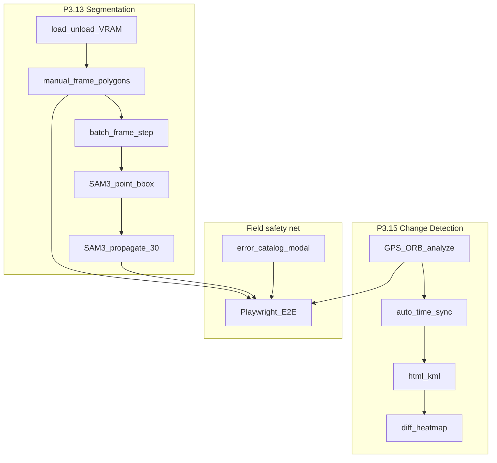

# Финальная ретроспектива Phase 3 / 4 (P3)

Закрытие большой инженерной сессии (сентябрь 2026) на ветке `feature/network-replication-3.1`.
Исторический черновик спринтов: [PHASE4_RETRO.md](PHASE4_RETRO.md) (в репо «Фаза 4» = backlog P3.13/P3.15 — теперь закрыт).

**Итог:** весь заявленный объём Phase 3 (segmentation + change detection + field safety net) **DONE**. Следующий горизонт — backlog (P3.13.3c, profiling), не «недоделанный P3».

---

## Закрытый объём (коммиты)

| ID | Задача | Коммит |
|----|--------|--------|
| P3.13 v1.1 | Seg archive: load/unload VRAM, manual frame | `ea881fc` |
| P3.13.2 | Batch segmentation (frame_step, modal, in-memory) | `2f7a86c` |
| P3.13.3a | SAM3 interactive refine (point/bbox, mutual VRAM) | `8baa39f` |
| P3.13.3b | SAM3 short propagate (≤30, temp clip, `seg_masks`) | `b533f0d` |
| P3.15.1 | Change Detection GPS + ORB, Compare Sync | `a798b15` |
| docs | Early Phase 4 retro + v2 backlog | `3bba220` |
| P3.15.2 | Auto Time Sync (tracks → detections) | `8279f8f` |
| P3.15.3 | HTML/KML export | `8f93bb1` |
| docs | Sprint 2 docs (E2E-first order) | `4bcf9fc` |
| E2E | Playwright seg + change analyze UI | `4aa75af` |
| Field UX | Error catalog + modal diagnostics | `7a30f1d` |
| P3.15.4 | Diff heatmap canvas overlay | `8b2ff99` |
| docs | Interim Phase 3 retro (до batch/SAM) | `4c1160e` |

## Метрики

| Метрика | Значение |
|---------|----------|
| Backend unit-тесты | **121+** OK (pre-commit на `b533f0d`) |
| Playwright (критичные UI) | seg toggle, batch seg, SAM3 load, SAM3 propagate, change analyze / heatmap / error modal |
| TypeScript | `tsc --noEmit` OK |
| Инварианты | Detect ≠ YOLO-seg ≠ SAM3 ≠ Change Detection — **сохранены** |
| Не трогали | `yolo_engine.py`, `trainer.py`, `api/detect.py`, `api/train.py` |

---

## Архитектурные победы

1. **Strict pipeline isolation** — Detect ≠ YOLO-seg ≠ SAM3. Никакого «подмешивания» масок в `yolo_engine` / `trainer` / Active Learning.
2. **Mutual VRAM exclusion** — на 8 ГБ (RTX 5060 Laptop): загрузка SAM3 выгружает YOLO-seg и наоборот; batch seg выгружает SAM с toast, без auto-reload.
3. **Air-gap ready** — whitelist весов (`yolo26n/s-seg.pt`, `sam3.pt`), без runtime download; нет файла → 503 + [ERROR_REFERENCE.md](ERROR_REFERENCE.md).
4. **Ephemeral vs persistent** — batch/propagate по умолчанию in-memory; `seg_masks` только opt-in, отдельная таблица, soft-delete по `track_id`, **не** связана с `detections`.
5. **Temp clip для VideoPredictor** — короткий клип ≤30 кадров вместо сканирования всего ролика (OOM / время).
6. **Variant A Compare Sync** — без новой вкладки TopBar; путь «Было/Стало → Sync → Анализ → Экспорт / Теплокарта».
7. **Отдельный `changeOverlays` + heatmap** — YOLO bbox и правки не ломаются.

---

## Уроки

| Тема | Урок |
|------|------|
| Temp clip | `SAM3VideoPredictor` на коротком клипе ≫ полный source path |
| E2E mocks | Playwright: `page.route` для seg/SAM/CD; реальный SAM/YOLO в CI запрещён |
| UX unload | Toast / notice обязателен: аналитик должен понимать *почему* модель выгрузилась |
| Circular imports | Lazy-import в CD / time_sync / resolve video при unittest без полного app |
| Store re-fetch | Seg status UI: mock + re-toggle overlayMode |
| Error envelope | FastAPI `detail` + опциональный `error{}` — не ломать старых клиентов |
| Heatmap gate | Не рисовать heatmap на чистом GPS high-coverage |
| Naming | «Фаза 4» в PHASE4_RETRO = исторический ярлык backlog; продукт = **Phase 3 / P3** |
| Малые коммиты | Одна фича — один коммит; проще откат в поле |

---

## Риски, которые остаются

- ORB чувствителен к свету/углу; см. [KNOWN_ISSUES.md](KNOWN_ISSUES.md).
- HTML export Leaflet/OSM CDN не работает в полном air-gap (таблицы — да).
- Seg/SAM VRAM остаются loaded до unload / ухода с SEG.
- Propagate ≤30 кадров — не полный tracking ролика (это backlog P3.13.3c).
- Playwright `workers=1` обязателен (конкуренция AL/API).
- `sam3.pt` ~3.5 ГБ — только офлайн-копия, не в git.

---

## Решение по мастер-плану

**P3 core (13–16 + batch + SAM3 3a/3b + P3.15 v2 + E2E + error catalog) — DONE.**

Следующий горизонт (не блокер Phase 3):

1. **P3.13.3c** — text/semantic prompts + Live exploration (высокий риск VRAM).
2. **Performance** — profiling batch/propagate на 8 ГБ.
3. **Полевой smoke** — реальные Было/Стало + SAM3 на архиве.
4. Новые фичи — только по запросу пользователя.

Вне скоупа: облако, SaaS, полноценный NLE.

---

## Чеклист закрытия Phase 3

- [x] Seg v1.1 archive-only (`ea881fc`)
- [x] Batch segmentation P3.13.2 (`2f7a86c`)
- [x] SAM3 interactive P3.13.3a (`8baa39f`)
- [x] SAM3 propagate P3.13.3b (`b533f0d`)
- [x] Change Detection v1 + v2 (sync, export, heatmap)
- [x] Playwright E2E для seg/SAM/CD
- [x] Справочник ошибок (catalog → API → modal)
- [x] Docs: ROADMAP / TODO / API / guides / ERROR_REFERENCE
- [x] Эта финальная ретроспектива (обновление после SAM3)

## Связанные документы

- [ROADMAP.md](ROADMAP.md) — статус P0–P3 + Future / Backlog
- [TODO.md](TODO.md) — backlog после Phase 3
- [PHASE4_RETRO.md](PHASE4_RETRO.md) — sprint notes (исторический)
- [ARCHITECTURE.md](ARCHITECTURE.md) — инварианты агента
- [ERROR_REFERENCE.md](ERROR_REFERENCE.md) — полевые ошибки
- [ANALYST_GUIDE.md](ANALYST_GUIDE.md) — workflow аналитика
- [FEATURES.md](FEATURES.md) — продуктовые возможности
