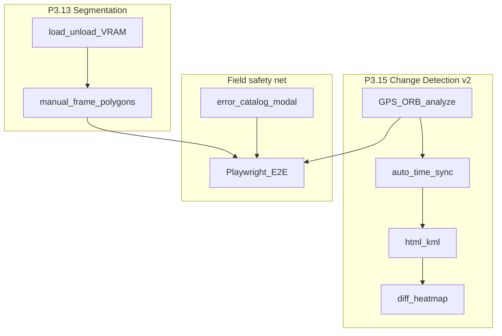

# Финальная ретроспектива Phase 3 (P3)

Закрытие большой сессии сентябрь 2026 на ветке `feature/network-replication-3.1`.
Исторический черновик спринтов: [PHASE4_RETRO.md](PHASE4_RETRO.md) (в репо «Фаза 4» = P3.13/P3.15).

**Итог:** P0–P3 roadmap core закрыт; P3.15 v2 (sync → analyze → export → heatmap) + Playwright E2E + справочник ошибок — в mainline ветки.

---

## Закрытый объём (коммиты)

| ID | Задача | Коммит |
|----|--------|--------|
| P3.13 v1.1 | Seg archive: load/unload VRAM, manual frame | `ea881fc` |
| P3.15.1 | Change Detection GPS + ORB, Compare Sync | `a798b15` |
| docs | Early Phase 4 retro + v2 backlog | `3bba220` |
| P3.15.2 | Auto Time Sync (tracks → detections) | `8279f8f` |
| P3.15.3 | HTML/KML export | `8f93bb1` |
| docs | Sprint 2 docs (E2E-first order) | `4bcf9fc` |
| E2E | Playwright seg + change analyze UI | `4aa75af` |
| Field UX | Error catalog + modal diagnostics | `7a30f1d` |
| P3.15.4 | Diff heatmap canvas overlay | `8b2ff99` |

## Метрики

| Метрика | Значение |
|---------|----------|
| Backend unit-тесты | **104** OK |
| Playwright (новые) | seg UI, change analyze, heatmap toggle, error modal |
| TypeScript | `tsc --noEmit` OK (на момент heatmap) |
| Инварианты | detect ≠ seg ≠ change detection — **сохранены** |
| Не трогали | `yolo_engine.py`, `trainer.py`, `api/detect.py`, `api/train.py` |

---

## Что получилось хорошо

1. **Жёсткое разделение пайплайнов** — seg и change detection как отдельные сервисы/API; обучение и live detect не раздувались.
2. **Variant A Compare Sync** — без новой вкладки TopBar; операторский путь «Было/Стало → Синхронизировать → Анализ → Экспорт / Теплокарта».
3. **Отдельный `changeOverlays` + heatmap под SVG** — YOLO bbox и правки не ломаются.
4. **Graceful degradation** — GPS → ORB → message; heatmap только когда image-path реально отработал.
5. **Документация как SoT** — ROADMAP/TODO/API/ANALYST/FEATURES обновлялись вместе с кодом; ERROR_REFERENCE для поля.
6. **Тестовая пирамида** — unit на движки + Playwright на UI с `page.route` (без VRAM/видео decode в CI).
7. **Малые коммиты по фичам** — проще откат в поле, чем monorepo-squash.

## Уроки

| Тема | Урок |
|------|------|
| Circular imports | Lazy-import в `change_detection` / `time_sync` обязателен при unittest без полного app |
| Store re-fetch | Seg status UI: mock + re-toggle overlayMode (эффект только на смене mode) |
| E2E sources | Для CD UI — `__muraveiStores.setSource`, не ждать dual video readyState |
| Error envelope | Оставлять FastAPI `detail` + добавлять `error{}` — иначе ломаются старые клиенты |
| Heatmap gate | Не считать heatmap при чистом GPS high-coverage — иначе ложный «шум» без выравнивания |
| Naming | «Фаза 4» в PHASE4_RETRO = P3 backlog; дальше говорить **Phase 3 / P3** единообразно |

## Риски, которые остаются

- ORB чувствителен к свету/углу; см. [KNOWN_ISSUES.md](KNOWN_ISSUES.md).
- HTML export Leaflet/OSM CDN не работает в полном air-gap (таблицы — да).
- Seg VRAM остаётся loaded до unload / ухода с SEG.
- Batch segmentation и SAM2 ещё не реализованы — отдельный спринт.
- Playwright workers=1 обязателен (конкуренция AL/API).

---

## Решение по мастер-плану

**P3 core (13–16 + P3.15 v2) — DONE.**

Следующий спринт (порядок):

1. **P3.13.2 Batch segmentation** (P1) — весь ролик, без train, по аналогии с `batch_scan`.
2. **P3.13.3 SAM2** (P2) — только при наличии модели и явного запроса.
3. Параллельно: полевой smoke на реальных Было/Стало роликах; profiling 8 GB VRAM.

Вне скоупа по-прежнему: облако, SaaS, полноценный NLE.

---

## Чеклист закрытия Phase 3

- [x] Seg v1.1 archive-only
- [x] Change Detection v1 + v2 (sync, export, heatmap)
- [x] Playwright E2E для seg/CD
- [x] Справочник ошибок (catalog → API → modal)
- [x] Docs: ROADMAP / TODO / API / guides / ERROR_REFERENCE
- [x] Эта финальная ретроспектива

## Связанные документы

- [ROADMAP.md](ROADMAP.md) — статус P0–P3
- [TODO.md](TODO.md) — следующий спринт = batch seg
- [PHASE4_RETRO.md](PHASE4_RETRO.md) — sprint notes
- [ARCHITECTURE.md](ARCHITECTURE.md) — инварианты
- [ERROR_REFERENCE.md](ERROR_REFERENCE.md) — полевые ошибки
- [ANALYST_GUIDE.md](ANALYST_GUIDE.md) — workflow аналитика
