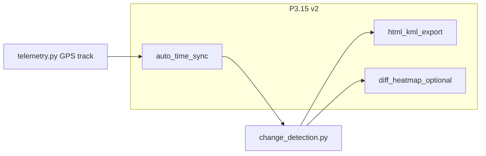

# Ретроспектива Фазы 4 (P3.13 + P3.15)

Зафиксировано после закрытия archive segmentation и Compare Sync change detection (сессия сентябрь 2026).

## Закрытые задачи

| ID | Задача | Коммит | Тесты |
|----|--------|--------|-------|
| P3.13 v1.1 | Seg-маски: explicit VRAM load/unload, manual frame | `ea881fc` | `test_segmentation.py` (10) |
| P3.15 v1 | Change Detection: GPS-matching + ORB fallback в Compare Sync | `a798b15` | `test_change_detection.py` (8) |

**Backend после Фазы 4:** 91 unit-тест OK. TypeScript `tsc --noEmit` OK.

## Что получилось хорошо

1. **Разделение пайплайнов** — detect / seg / change detection без правок `yolo_engine.py`, `trainer.py`, `api/detect.py`, `api/train.py`.
2. **Compare Sync integration (Variant A)** — без новой вкладки TopBar; кнопка «Анализ изменений» на viewer-1; Inspector «Изменения (Compare)».
3. **Отдельный слой `changeOverlays`** — не мутирует YOLO `overlayObjects`; drag/edit детекций сохранён.
4. **Sync-aware time window** — `time_window_sec=0.5` при Sync (drift 500 ms), `2.0` без Sync.
5. **Graceful degradation** — GPS coverage <30% → ORB/diff fallback; partial GPS result при слабом ORB.
6. **Отдельные коммиты** P3.13 → P3.15 — проще откат при проблемах в поле.

## Уроки и риски

| Тема | Деталь |
|------|--------|
| Circular import | `change_detection.py` — lazy-import `_resolve_video` / `list_detections` (цепочка `batch_scanner` → `yolo_engine` → `main`) |
| ORB fallback | Чувствителен к освещению и углу камеры; `inlier_ratio < 0.25` → `aligned: false` — см. [KNOWN_ISSUES.md](KNOWN_ISSUES.md) |
| GPS точность | Matching только для детекций с `gps_lat/lon`; качество sidecar SRT/CSV критично |
| E2E пробел | Seg и change detection пока только unit + ручной тест; Playwright — в v2 backlog |
| VRAM seg | Модель остаётся loaded до explicit unload или SEG→Детекция в Viewer |

## Метрики сессии

- **2 major features** shipped
- **+18 unit-тестов** (10 seg + 8 change detection)
- **2 commits pushed** на `feature/network-replication-3.1`
- **~95% roadmap P0–P3 v1** закрыто (см. [ROADMAP.md](ROADMAP.md))

## Следующий спринт — черновик P3.15 v2

Приоритет после ретроспективы: **auto time sync + HTML/KML export** (критично для аналитиков).

### P3.15.2 — Auto time sync (P0) — DONE

- `time_sync.py`: GPS tracks (haversine + smoothing) → detections (bbox center) → segments.
- UI: CompareSyncModal, кнопка «Синхронизировать» в Compare Sync toolbar.
- API: `POST /api/change-detection/sync`.

### P3.15.3 — HTML/KML export (P0)

- `GET /api/change-detection/export?format=html|kml` или POST с телом last result.
- Переиспользовать [`geo_export.py`](../backend/services/geo_export.py) для KML точек new/moved.

### P3.15.4 — Diff heatmap (P1, отдельный PR)

- Canvas overlay областей `image_diff.regions`; toggle в Viewer compare mode.

**Не в v2.0:** batch seg, SAM2, Playwright E2E (отдельные пункты backlog в [TODO.md](TODO.md)).

## Связанные документы

- [ROADMAP.md](ROADMAP.md) — P3 v1 DONE, v2 backlog
- [TODO.md](TODO.md) — чеклисты следующего спринта
- [ARCHITECTURE.md](ARCHITECTURE.md) — инварианты seg / change detection (часть B)
